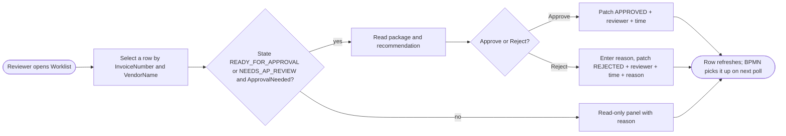

# Solution Design Document — ap-approval-review-sagar

> **Template:** Coded Apps (web applications). If chosen when the PDD lacked UI details, gap-filling Q&A in Phase 1 should have filled: framework, app type, pages/routes, state management.
> **Phase 2 sections:** §2, §3, §4, §5, §6, §10. **Phase 3 sections:** all others.
> **Data:** synthetic, USD only. Field names and format descriptions only — no sample amounts or tax IDs.

---

## Document History

| Date | Version | Author | Role | Comments |
|---|---|---|---|---|
| 2026-10-08 | 1.0 | uipath-planner | Generated by AI Agent | Initial SDD generated from `invoice-approval-pdd.md` and its gap analysis |

---

<!-- DO NOT RENAME: uipath-planner detects SDDs via this exact heading or the marker below. -->
<!-- planner-handoff:v1 -->
## Planner Handoff

| Field | Value |
|---|---|
| **Status** | ready |
| **Execution autonomy** | autonomous |
| **Delivery model** | cloud |
| **SDD scope** | solution |
| **Solution root SDD** | invoice-approval-solution-sdd.md |
| **Solution ID** | invoice-approval |
| **Project SDD role** | child |
| **Independently executable** | no — Lane A derives tasks only via the Solution root |
| **Project list section** | §10 Project Structure + §9 Integrated Components |
| **Tasks file** | `implementation-tasks.md` |
| **Generated by** | uipath-planner |
| **Generation date** | 2026-10-08 |
| **Template validation** | passed |

---

## Decisions Made

> Autonomous mode picked the architectural decisions below without a user checkpoint. Override by rerunning in Interactive mode or by editing the relevant SDD section.

| # | Decision | Picked | One-sentence reason |
|---|---|---|---|
| 1 | **Scope** (Level 1) | Solution child — Coded Web App | PDD step 5 needs a reviewer worklist across many invoices, not a per-task form. |
| 2 | **App type & framework** | Web + React 19 / Vite / Tailwind, `@uipath/uipath-typescript` SDK | Matches the deployed v1.0.0 app; the SDK reads and updates the entity with the user's own identity. |

---

## Recommended Scope

**Recommendation:** SOLUTION(Maestro BPMN, RPA Process ×2, Agents ×2, Coded App; components: IXP model, Coded Functions, Data Fabric)
**Delivery model:** cloud
**Blocked by platform:** none
**Need profile:** Let the AP reviewer read each package and record approve / reject with reviewer, timestamp and reason on exactly one record (PDD step 5, AC-8, AC-11).

---

## Action Required — SME Review Items

| # | Section | Item | Question | Default applied | Blocking |
|---|---|---|---|---|---|
| 1 | §6 | PDD Q5 — rejection reason | Where is the reason stored? | New entity field `RejectionReason` (text, ≤ 500 chars), required on Reject. | no |
| 2 | §7 | PDD Q2 — missing evidence | Can the reviewer decide a NEEDS_AP_REVIEW invoice? | Yes — Approve and Reject both enabled, with a one-line note that evidence is incomplete (MissingApprovalFields). | no |
| 3 | §1 | Concurrent users | How many reviewers? | A few AP users. | no |

> These items are marked `[SME REVIEW]` in the document. Default-carried items (Blocking = no) do not block task derivation — the automation is built on the recorded defaults, which must be verified before production sign-off. Any Blocking = yes item keeps the handoff at `Status: draft`.

---

## Table of Contents

1. App Overview
2. App Type & Tech Stack
3. Pages & Routes
4. Components
5. State Management
6. API Integration
7. User Flows
8. Error Handling
9. Integrated Components
10. Project Structure
11. Testing Strategy
12. Next Steps

---

## 1. App Overview

| Field | Value |
|---|---|
| **App name** | ap-approval-review-sagar ("AP Approval Review") |
| **Objective** | Show invoices awaiting a decision with their approval package and recommendation, and record the reviewer's approve / reject decision on the invoice record. |
| **Primary users** | AP reviewer (acting for the named budget approver) |
| **Trigger** | User navigation to the deployed app URL |
| **Expected concurrent users** | [SME REVIEW] a few AP users |
| **Source PDD** | `invoice-approval-pdd.md` (step 5, D3, E8, AC-8, AC-11) |

### In Scope

- Worklist of `AP_Invoice_Sagar` records with KPI strip and charts.
- Detail panel: approval package, recommendation, evidence state, missing fields.
- Approve / Reject when `InvoiceLifecycleState ∈ {READY_FOR_APPROVAL, NEEDS_AP_REVIEW}` and `ApprovalNeeded = true`.
- Write `InvoiceLifecycleState`, `ReviewedBy`, `ReviewedAt` and (new) `RejectionReason`.

### Out of Scope

- Posting (PostToERP) and editing invoice data or approval inputs.
- Showing VendorTaxId (masked / not displayed).

### Assumptions

- Reviewers sign in with their UiPath identity (OAuth PKCE) and hold entity read/update rights.
- BPMN reads the decision by polling `get_invoice_status`; the app does not call BPMN.

---

## 2. App Type & Tech Stack

### App Type

- [x] **Web** — standalone web app users navigate to
- [ ] **Action** — triggered by an automation, receives and returns data

### Tech Stack

**Framework:** React 19
**Build tool:** Vite
**UI library:** Tailwind CSS (bare utility styling), lucide-react icons
**State management:** React hooks / Context (`useAuth`, `useInvoices`, `useDecision`, `useSchema`)

**Justification:** The app is a single worklist with a detail panel; local hooks keep data flow simple. The `@uipath/uipath-typescript` SDK provides OAuth and entity access by name without a custom backend.

---

## 3. Pages & Routes

| Route | Page Name | Purpose | Who Sees It |
|---|---|---|---|
| `/` (signed out) | SignInPage | Start OAuth sign-in | Any user |
| `/` (gate) | GatePage | Block users without entity access; show the reason | Signed-in user without rights |
| `/` (signed in) | Worklist | Invoice table, KPI strip, charts, detail panel, decision | AP reviewer |

---

## 4. Components

| Component Name | Type | Used On Pages | Purpose |
|---|---|---|---|
| `InvoiceTable` | TABLE | Worklist | Rows by InvoiceNumber / VendorName / state (no Record Id column) |
| `KpiStrip` | LAYOUT | Worklist | Counts per lifecycle state |
| `Charts` | LAYOUT | Worklist | State distribution |
| `InvoiceDetailPanel` | FORM | Worklist | Package, recommendation, Approve / Reject, reason input |
| `ApprovalPackageView` | LAYOUT | Worklist | Renders ApprovalPackageJson (confidential — authorized users only) |
| `EvaluationTag` | LAYOUT | Worklist | Evidence state / recommendation badge |
| `StateViews` | LAYOUT | all | Loading, empty, error states |

---

## 5. State Management

### Global State

| State Slice | Type | Purpose |
|---|---|---|
| auth | USER | Signed-in user, token lifecycle (`useAuth`) |
| invoices | DATA | Records read via `getRecordsByName` (`useInvoices`) |
| schema | DATA | Entity field metadata (`useSchema`) |

### Local Component State

- `InvoiceDetailPanel`: uses local state for the pending decision, the rejection reason text and the submit status (`useDecision`).

---

## 6. API Integration

| Backend | Type | Purpose | Auth |
|---|---|---|---|
| Data Fabric `AP_Invoice_Sagar` | REST via `@uipath/uipath-typescript` | `getByName`, `getRecordsByName`, `getRecordByName`, `updateRecord({ name }, id, patch)` | OAuth PKCE (user identity) |

`uipath.json` baseUrl is the plain host `https://staging.uipath.com`; the deployed app gets the API host injected.

**Decision patch (one record only):**

| Field | Approve | Reject |
|---|---|---|
| `InvoiceLifecycleState` | APPROVED | REJECTED |
| `ReviewedBy` | signed-in user name | signed-in user name |
| `ReviewedAt` | now (UTC, DATETIME_WITH_TZ) | now (UTC) |
| `RejectionReason` (new field) | — | required, 1–500 chars |

### UiPath API Workflow Calls

| API Workflow | Called From | Input | Output |
|---|---|---|---|
| — | — | None | — |

### Integration Service Connections

| Connector | System | Access Method | Used By |
|---|---|---|---|
| — | — | None (platform SDK only) | — |

---

## 7. User Flows

### Flow: Review and decide



**Description:** The reviewer picks a row, reads the package (with a one-line note when evidence is incomplete), and approves or rejects. Reject cannot be submitted without a reason. After the update the app reloads the record and confirms that only that record changed state.

---

## 8. Error Handling

| Error Scenario | User-Facing Behavior | Logging |
|---|---|---|
| API call fails | Error banner with retry; decision not shown as saved | Console (no record values) |
| Validation error | Inline message: reason required on Reject | NO |
| Session expired | Redirect to SignInPage | NO |
| Record changed by someone else | Reload and show the new state; block a second decision | Console |

---

## 9. Integrated Components

### Called By (if Action app)

| Caller | Type | Context |
|---|---|---|
| — | — | Not an Action app; BPMN reads the outcome from the record |

### HITL Form Role

- [ ] This app is a HITL form renderer (called from `uipath-human-in-the-loop` touchpoints)
- [x] This app is standalone

---

## 10. Project Structure

```text
ap-approval-review-Sagar/
├── .uipath/                 (git-ignored)
├── uipath.json
├── src/
│   ├── App.tsx, main.tsx
│   ├── screens/             SignInPage, GatePage, Worklist
│   ├── components/          InvoiceTable, InvoiceDetailPanel, ApprovalPackageView, KpiStrip, Charts, EvaluationTag, StateViews
│   ├── data/                invoice.ts, fields.ts, errors.ts, useInvoices, useDecision, useSchema
│   ├── hooks/useAuth.tsx
│   └── config/app.ts
├── public/
├── package.json
└── dist/                    (build output — required before pack)
```

### Deployment Target

- [ ] Development workspace (default — the specialist's own authoring/publish surface)
- [x] Orchestrator (for production) — `npm run build` → `uip codedapp pack dist` → `publish -t Web` → `deploy --folder-key`; bump the version after any change

### Solution / Project Breakdown

| Project | Product (RPA / API / Agent / …) | GitHub Repository | Folder | Attended / Unattended |
|---|---|---|---|---|
| ap-approval-review-sagar | Coded App (web) | `UiPath-Coders/commercial_bootcamp_Sagar` (`lab6-coded-app/ap-approval-review-Sagar`) | `Agentic Bootcamp/APAutomation_Sagar` | N-A |

### Reusable Components

| Type (reused / new-reusable) | Name | Details |
|---|---|---|
| reused | `@uipath/uipath-typescript` | ^1.8.0 |
| reused | Deployed app v1.0.0 | Extend, do not rebuild |

### Environments (DEV / UAT / PROD)

| Item | DEV | UAT | PROD | Used By |
|---|---|---|---|---|
| Orchestrator + Tenant/Service | staging / customersuccessamer / Training | [SME REVIEW] | [SME REVIEW] | This app |
| Folder | `Agentic Bootcamp/APAutomation_Sagar` | [SME REVIEW] | [SME REVIEW] | This app |

### Non-Functional Requirements

| Dimension | Requirement / Design decision |
|---|---|
| **Security** | OAuth PKCE; no secrets in the bundle; VendorTaxId not displayed; package and amounts only for authorized AP users; no record values in console logs |
| **Performance** | One records query per load; refresh after each decision |
| **Scalability** | Static hosting; a few concurrent users |
| **Availability / Resilience** | Retry UI on API failure; optimistic update disabled (confirm from server) |
| **Logging & Monitoring** | Client error logging without values |
| **Compliance** | PDD §11; reviewer and timestamp on every decision |

---

## 11. Testing Strategy

### Canonical Test Cases

| Test ID | User Flow | Input | Expected Outcome |
|---|---|---|---|
| T-01 | Review and decide | Approve a READY_FOR_APPROVAL row (state its InvoiceNumber and VendorName) | Record APPROVED with ReviewedBy / ReviewedAt; no other record changed |
| T-02 | Review and decide | Reject a NEEDS_AP_REVIEW row with a reason | Record REJECTED with reason, reviewer, time |
| T-03 | Review and decide | Reject with an empty reason | Inline error; nothing saved |
| T-04 | Review and decide | Select a POSTED or AUTO_APPROVED row | Read-only panel; no buttons |
| T-05 | Sign-in | User without entity rights | GatePage with reason |

### Unit Tests

- Component rendering
- State management logic
- API error handling

### E2E Tests

- Playwright: sign in, approve one row, verify the server state, verify the count of APPROVED / REJECTED rows rose by exactly one.

---

## 12. Next Steps

This SDD captures architecture and decisions. To generate the implementation task list and execute the build, load `uipath-planner` with the Solution root SDD path (this child is not independently executable):

> Load `uipath-planner`. SDD path: `invoice-approval-solution-sdd.md`.

The planner detects the `## Planner Handoff` header, parses §10 Project Structure and §9 Integrated Components, derives the per-skill task list (routing each task to `uipath-coded-apps`, `uipath-platform`, etc.), writes `implementation-tasks.md` alongside this SDD, and emits live `TaskCreate` calls. If `Execution autonomy: interactive`, it enters plan mode for task review before execution.

Implementation tasks **do not live in this SDD** — they live in the planner's output.

---

**End of Solution Design Document.**
