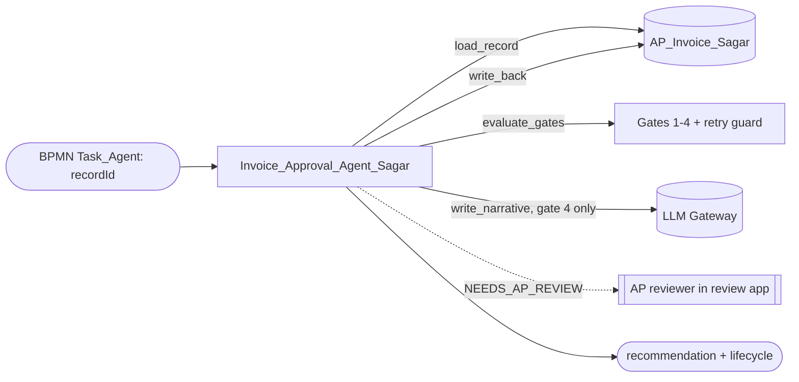

# Solution Design Document — Invoice_Approval_Agent_Sagar

> **Template:** UiPath Agents (Python/coded or low-code). If chosen when the PDD lacked AI-specific details, gap-filling Q&A in Phase 1 should have filled: framework choice, tools, memory/RAG, evaluation criteria.
> **Phase 2 sections:** §2, §3, §4, §6, §9. **Phase 3 sections:** all others.
> **Data:** synthetic, USD only. Field names and format descriptions only — no sample amounts or tax IDs.

---

## Document History

| Date | Version | Author | Role | Comments |
|---|---|---|---|---|
| 2026-10-08 | 1.0 | uipath-planner | Generated by AI Agent | Initial SDD generated from `invoice-approval-pdd.md` and its gap analysis |

---

<!-- DO NOT RENAME: uipath-planner detects SDDs via this exact heading or the marker below. -->
<!-- planner-handoff:v1 -->
## Planner Handoff

| Field | Value |
|---|---|
| **Status** | ready |
| **Execution autonomy** | autonomous |
| **Delivery model** | cloud |
| **SDD scope** | solution |
| **Solution root SDD** | invoice-approval-solution-sdd.md |
| **Solution ID** | invoice-approval |
| **Project SDD role** | child |
| **Independently executable** | no — Lane A derives tasks only via the Solution root |
| **Project list section** | §9 Project Structure |
| **Tasks file** | `implementation-tasks.md` |
| **Generated by** | uipath-planner |
| **Generation date** | 2026-10-08 |
| **Template validation** | passed |

---

## Decisions Made

> Autonomous mode picked the architectural decisions below without a user checkpoint. Override by rerunning in Interactive mode or by editing the relevant SDD section.

| # | Decision | Picked | One-sentence reason |
|---|---|---|---|
| 1 | **Scope** (Level 1) | Solution child — coded Agent | PDD step 4 needs a reviewer-ready narrative and recommendation over mixed evidence. |
| 2 | **Agent framework** | LangGraph with a deterministic gate core | Gates are rule-expressible (deterministic, auditable); only the gate-4 narrative needs an LLM. |

---

## Recommended Scope

**Recommendation:** SOLUTION(Maestro BPMN, RPA Process ×2, Agents ×2, Coded App; components: IXP model, Coded Functions, Data Fabric)
**Delivery model:** cloud
**Blocked by platform:** none
**Need profile:** Give every approval-path invoice a complete, explained approval package or a clear missing-evidence flag (PDD step 4, BR-6, AC-7).

---

## Action Required — SME Review Items

| # | Section | Item | Question | Default applied | Blocking |
|---|---|---|---|---|---|
| 1 | §3 Gate 3 | Required inputs vs PDD BR-6 | Must all seven approval inputs be present, or four? | Four required (GL Account, Cost Center, Approver, Receipt Reference); Payment Terms, Vendor Risk Score, Invoice Line Summary shown when present. | no |
| 2 | §3 Gate 1 | PDD Q1 | Should unmatched POs get a package for approval? | No — HOLD_PO_MISMATCH, no LLM call, BPMN ends Held. | no |
| 3 | §1 | LLM model | Keep the configured model? | `gpt-4o-2024-11-20` via UiPath LLM Gateway, temperature 0; template narrative as fallback. | no |

> These items are marked `[SME REVIEW]` in the document. Default-carried items (Blocking = no) do not block task derivation — the automation is built on the recorded defaults, which must be verified before production sign-off. Any Blocking = yes item keeps the handoff at `Status: draft`.

---

## Table of Contents

1. Agent Overview
2. Agent Framework
3. Tools
4. Memory / RAG
5. Evaluation Criteria
6. Orchestrator Bindings
7. Error Handling & Escalation
8. Integrated Components
9. Project Structure
10. Testing Strategy
11. Next Steps

---

## 1. Agent Overview

| Field | Value |
|---|---|
| **Agent name** | Invoice_Approval_Agent_Sagar |
| **Role** | Approval Package Agent |
| **Objective** | For one invoice record: decide the evidence state, list missing approval inputs, set a recommendation and lifecycle state, and write a structured approval package with a reviewer narrative. |
| **Trigger** | Orchestrator job from BPMN `Task_Agent` with input `{"recordId": "<Data Fabric Id>"}` |
| **Expected LLM model** | `gpt-4o-2024-11-20` (config default, overridable by env var); called only on gate 4 |
| **Expected volume** | [SME REVIEW] one run per approval-path invoice |
| **Source PDD** | `invoice-approval-pdd.md` (step 4, BR-6, E7, AC-7) |

### In Scope

- Retry guard: never reprocess a prepared record; never downgrade APPROVED, REJECTED or POSTED.
- Gates 1–4 (deterministic) and the gate-4 narrative (LLM, with template fallback).
- Write ApprovalEvidenceState, MissingApprovalFields, AgentRecommendation, ApprovalPackageJson, AgentProcessedAt, InvoiceLifecycleState.

### Out of Scope

- The approve / reject decision (AP reviewer in the review app).
- PO matching (POMatch) and posting (PostToERP).

### Assumptions

- POMatched and ApprovalNeeded are already set by POMatch before this agent runs.
- Approval inputs (GL Account … Invoice Line Summary) are present on the record from upstream data entry or enrichment [SME REVIEW] source of these values.

---

## 2. Agent Framework

**Selected framework:** LangGraph

| Framework | Best For | Chosen? |
|---|---|---|
| Simple Function | Single-turn Q&A, no tool chaining | NO |
| LangGraph | Complex multi-step reasoning, state machines | YES |
| LlamaIndex | RAG-heavy agents, document search | NO |
| OpenAI Agents | OpenAI-native tool calling | NO |

**Justification:** The run is a small state machine (`load_record → evaluate_gates → write_narrative? → write_back → finish`) with conditional edges; LangGraph makes the gate routing explicit and testable. Gate logic stays in pure functions (`approval_gates.py`), so the LLM never decides the recommendation.

---

## 3. Tools

| Tool Name | Tool Type | Repo / IS URL | Purpose | Input Schema | Output Schema |
|---|---|---|---|---|---|
| `load_record` | PYTHON_FN (`data_fabric.py`) | `lab5-coded-agent/agent/Invoice_Approval_Agent_Sagar` | Read the record by Id (case-insensitive field names) | `recordId: str` | record mapping (VendorTaxId excluded from state) |
| `evaluate_gates` | PYTHON_FN (`approval_gates.py`) | same | Retry guard + gates 1–4 | record | `GateResult{evidence, missing, recommendation, lifecycle, gate}` |
| `write_narrative` | PYTHON_FN + LLM (`narrative.py`) | same | Reviewer summary and risk flags (gate 4 only) | non-confidential facts | `{summary, risk_flags, source, model}` |
| `write_back` | PYTHON_FN (`data_fabric.py`) | same | Update the same record | decision + narrative | updated fields |

**Gates (evaluated in order, first match wins):**

| # | Condition | Evidence state | Recommendation / lifecycle | LLM? |
|---|---|---|---|---|
| 1 | POMatched false | NOT_EVALUATED | HOLD_PO_MISMATCH | no |
| 2 | ApprovalNeeded false | NOT_REQUIRED | AUTO_APPROVED | no |
| 3 | any of GLAccount, CostCenter, Approver, ReceiptReference empty | INCOMPLETE | NEEDS_AP_REVIEW | no |
| 4 | otherwise | COMPLETE | READY_FOR_APPROVAL | yes (narrative only) |

### Tool Invocation Policy

- `load_record`: always first; on RECORD_NOT_FOUND / READ_FAILED go straight to `finish`.
- `evaluate_gates`: always after a successful load; the retry guard returns the stored result when a package exists or the state is APPROVED / REJECTED / POSTED.
- `write_narrative`: only when gate 4 fires; on LLM failure use the template narrative.
- `write_back`: after gates (and narrative); never writes VendorTaxId.

### Agent Configuration

| Field | Value |
|---|---|
| **Agent type** | FUNCTIONAL |
| **Primary function** | Record Id → approval package + recommendation on the same record |
| **Agent hosting** | CLOUD (staging) |
| **Arguments — in** | `recordId: string` |
| **Arguments — out** | `recordId: string`, `approvalEvidenceState: string`, `missingApprovalFields: string[]`, `recommendation: string`, `invoiceLifecycleState: string`, `wasAlreadyPrepared: boolean`, `errorType: string?`, `errorMessage: string?` |

### Agent Interaction Diagram



---

## 4. Memory / RAG

### Short-term Memory

- [x] Required
- [ ] Not required

**Purpose:** WITHIN_SESSION_CONTEXT — LangGraph state for one run (never holds VendorTaxId)

### Long-term Memory

- [ ] Required (via UiPath memory service or external store)
- [x] Not required

**Purpose:** NONE — the record itself is the durable state

### RAG Sources

| Source Name | Type | Description | Indexing Strategy |
|---|---|---|---|
| — | — | Not required | — |

---

## 5. Evaluation Criteria

### Success Metrics

| Metric | Target | Measurement |
|---|---|---|
| Gate correctness | 100% of eval rows get the expected recommendation and evidence state | `uip codedagent eval` (json-similarity) |
| Missing-field accuracy | exact list for every INCOMPLETE row | eval assertion |
| LLM calls on gates 1–3 | 0 | `uip traces spans get <TraceId>` |
| Retry guard | 0 second LLM calls on a prepared record | traces on a gate-4 record |

### Trajectory Evaluation

| Test Case | Expected Tool Sequence | Acceptable Variations |
|---|---|---|
| Gate 1 (PO mismatch) | load_record → evaluate_gates → write_back → finish | none |
| Gate 2 (auto-approved) | load_record → evaluate_gates → write_back → finish | none |
| Gate 3 (incomplete) | load_record → evaluate_gates → write_back → finish | none |
| Gate 4 (complete) | load_record → evaluate_gates → write_narrative → write_back → finish | template narrative on LLM failure |
| Already prepared | load_record → evaluate_gates → finish | none |

### LLM-Judge Criteria

| Criterion | Description | Pass Threshold |
|---|---|---|
| Faithful summary | Narrative states only facts present on the record; no invented amounts or approvers | no unsupported claims |
| No confidential echo | Narrative contains no tax ID | 0 occurrences |

---

## 6. Orchestrator Bindings

| Binding Name | Resource Type | Purpose |
|---|---|---|
| `AP_Invoice_Sagar` | Data Fabric entity (by name) | Read and update the invoice record |
| LLM Gateway | CONNECTION (platform) | Narrative model |
| Process `Invoice_Approval_Agent_Sagar` | PROCESS | Created with `uip or processes create` in `Agentic Bootcamp/APAutomation_Sagar` |

---

## 7. Error Handling & Escalation

### Agent-level errors

| Error Scenario | Handling |
|---|---|
| Tool invocation fails | RETURN_ERROR — `errorType` INVALID_INPUT / RECORD_NOT_FOUND / READ_FAILED / WRITE_FAILED; record unchanged on read errors |
| LLM refuses or returns invalid output | Template narrative (`source: template`); recommendation unaffected |
| Rate limit hit | Fall back to template narrative [DEFAULT] |

Governance-policy fetch 403 messages in job logs are expected noise.

### HITL Escalation

| Scenario | Escalation Type | Who Resolves |
|---|---|---|
| Missing approval evidence (gate 3) | Record flagged NEEDS_AP_REVIEW with MissingApprovalFields; surfaced in the review app | AP reviewer |
| Complete package (gate 4) | READY_FOR_APPROVAL; reviewer decides in the review app | AP reviewer for the budget approver |

**Note:** Escalation is state-based (Data Fabric + review app); no SDK escalation is wired inside the agent.

---

## 8. Integrated Components

### RPA Processes Called as Tools

| Process Name | Tool Name | Purpose |
|---|---|---|
| — | — | None |

### API Workflows Called as Tools

| API Workflow Name | Tool Name | Purpose |
|---|---|---|
| — | — | None |

### Integration Service Connectors

| Connector | Tool Name | Operation |
|---|---|---|
| — | — | None |

### Integration Service Connections

| Connector | System | Access Method | Used By |
|---|---|---|---|
| Data Fabric | AP_Invoice_Sagar | UiPath Python SDK | `load_record`, `write_back` |

---

## 9. Project Structure

### Implementation Mode

- [x] **Coded Agent** (Python) — recommended for complex logic, custom frameworks
- [ ] **Low-code Agent** (agent.json via Agent Builder) — recommended for simple agents

### Coded Agent Structure

```text
Invoice_Approval_Agent_Sagar/
├── pyproject.toml           # NO [build-system] section
├── langgraph.json
├── uipath.json
├── entry-points.json
├── bindings.json
├── main.py                  # graph: load_record → evaluate_gates → write_narrative → write_back → finish
├── approval_gates.py        # deterministic retry guard + gates 1–4
├── narrative.py             # LLM narrative with template fallback
├── data_fabric.py           # record read / update by entity name
├── config.py
├── evaluations/
│   ├── eval-sets/smoke-test.json
│   └── evaluators/json-similarity.json
└── tests/
```

### Low-code Agent Structure

Not used — this is a coded agent.

### Solution / Project Breakdown

| Project | Product (RPA / API / Agent / …) | GitHub Repository | Folder | Attended / Unattended |
|---|---|---|---|---|
| Invoice_Approval_Agent_Sagar | Agent (coded, LangGraph) | `UiPath-Coders/commercial_bootcamp_Sagar` (`lab5-coded-agent/agent/`) | `Agentic Bootcamp/APAutomation_Sagar` | Unattended |

### Reusable Components

| Type (reused / new-reusable) | Name | Details |
|---|---|---|
| reused | `approval_gates.py` | Pure gate functions; also the oracle for eval rows |
| new-reusable | — | — |

### Environments (DEV / UAT / PROD)

| Item | DEV | UAT | PROD | Used By |
|---|---|---|---|---|
| Orchestrator + Tenant/Service | staging / customersuccessamer / Training | [SME REVIEW] | [SME REVIEW] | This agent |
| Folder | `Agentic Bootcamp/APAutomation_Sagar` | [SME REVIEW] | [SME REVIEW] | This agent |

### Non-Functional Requirements

| Dimension | Requirement / Design decision |
|---|---|
| **Security** | VendorTaxId never in graph state (run output prints state per node); narrative input excludes tax ID; records-update responses are not printed |
| **Performance** | LLM only on gate 4, max 600 tokens, temperature 0 |
| **Scalability** | One job per approval-path invoice |
| **Availability / Resilience** | Retry guard makes re-runs safe; template fallback when the LLM is unavailable |
| **Logging & Monitoring** | Traces per job; eval pass rate per change |
| **Compliance** | PDD §11; recommendation is deterministic and auditable |

---

## 10. Testing Strategy

### Canonical Test Case

| Input | Expected Output |
|---|---|
| `recordId` of a record with POMatched true, ApprovalNeeded true, all four required inputs present | `recommendation = READY_FOR_APPROVAL`, `approvalEvidenceState = COMPLETE`, `missingApprovalFields = []`, package written, AgentProcessedAt set |

### Evaluation Dataset

| Test ID | Input | Expected Trajectory | LLM-Judge Criteria |
|---|---|---|---|
| T-01 | record with POMatched false | gate 1, no narrative | HOLD_PO_MISMATCH / NOT_EVALUATED |
| T-02 | record with ApprovalNeeded false | gate 2, no narrative | AUTO_APPROVED / NOT_REQUIRED |
| T-03 | record missing Approver and Receipt Reference | gate 3, no narrative | NEEDS_AP_REVIEW; missing list exact |
| T-04 | complete record | gate 4 + narrative | faithful summary, no confidential echo |
| T-05 | T-04 run again | retry guard | `wasAlreadyPrepared = true`; no second LLM span |
| T-06 | record already APPROVED / REJECTED / POSTED | retry guard | state unchanged |
| T-07 | unknown recordId | finish | `errorType = RECORD_NOT_FOUND` |

### Regression Strategy

- Run evaluation dataset on every code change
- Track pass rate over time
- Any drop below 100% on T-01–T-07 blocks deployment

---

## 11. Next Steps

This SDD captures architecture and decisions. To generate the implementation task list and execute the build, load `uipath-planner` with the Solution root SDD path (this child is not independently executable):

> Load `uipath-planner`. SDD path: `invoice-approval-solution-sdd.md`.

The planner detects the `## Planner Handoff` header, parses the project structure, derives the per-skill task list (routing each task to `uipath-agents`, `uipath-platform`, etc.), writes `implementation-tasks.md` alongside this SDD, and emits live `TaskCreate` calls. If `Execution autonomy: interactive`, it enters plan mode for task review before execution.

Implementation tasks **do not live in this SDD** — they live in the planner's output.

---

**End of Solution Design Document.**
