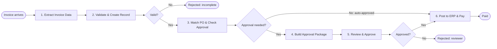

# Process Design Document: Vendor Invoice Approval

| Item | Value |
|---|---|
| Process name | Vendor Invoice Approval (invoice to payment) |
| Process owner | Accounts Payable (AP) |
| Document type | Process Design Document (business source of truth) |
| Source | `source-process.md` and the Lab 7 PDD brief |
| Status | Draft for review |
| Data | Synthetic data only; all amounts in USD |

This document describes **what** the business process must do. It does not prescribe the technology used to
implement it. Where the business has not yet decided something, it is listed under Open questions
(section 14) instead of being assumed.

---

## 1. Purpose

Finance pays vendor invoices only after it has confirmed that each invoice is complete, that it bills a real
purchase order (PO) for the right amount, and that it has approval where policy requires it. Today this work is
mostly manual: staff key invoice data, chase approvers, and reconcile POs by hand. It takes days.

The target process aims to:

1. **Reduce manual invoice entry.** Invoice data is captured from the document, not retyped.
2. **Reduce approval delays.** Approvers receive a complete, structured approval package with a recommendation.
3. **Capture more early-payment discounts.** Invoices reach posting and payment sooner.
4. **Remove duplicate-payment risk.** Each invoice has one record, and an invoice that has already been posted
   is never posted again.

## 2. Scope

**In scope**

- Vendor invoices received as documents (for example, PDF attachments).
- Capturing the eight invoice fields from the document.
- Checking structural completeness and creating one invoice record per valid invoice.
- Matching against the PO in the ERP, and deciding whether approval is required.
- Assembling an approval package with a recommendation for invoices that need approval.
- The AP reviewer's approve or reject decision, recorded on the invoice record.
- Posting eligible invoices to the ERP / AP portal, submitting them for payment, and closing them.

**Out of scope:** see section 13.

## 3. Actors

| Actor | Role in the process |
|---|---|
| Vendor | Sends the invoice. Is told when an invoice is rejected as structurally incomplete. |
| AP reviewer | Reads approval packages and recommendations, approves or rejects, and resolves invoices flagged for missing evidence. |
| Budget approver | The budget owner named on the approval package. Owns the business decision. **In this lab the AP reviewer acts on the budget approver's behalf.** |
| ERP | System of record for purchase orders, vendor status, and payments. |

## 4. Systems

| System | Business role |
|---|---|
| Invoice intake channel | Where vendor invoices arrive (for example, an email inbox or a document drop location). |
| Invoice record store | Holds the single invoice record that every step reads and updates. |
| ERP | Holds POs (existence, open amount), vendor status (active/inactive), and payments. |
| ERP / AP portal | Where invoices are posted and submitted for payment. |
| Review workspace | Where the AP reviewer sees the approval package and records the decision. |

The technology behind each system is an implementation choice and is not fixed by this document.

## 5. Trigger

The process starts when **a vendor invoice document arrives** in the invoice intake channel. Each arriving
document starts one run of the process.

## 6. Process steps

### Step 1. Extract Invoice Data

- **Input:** the vendor invoice document.
- **Activity:** read these eight fields from the document:

  | Field | Description |
  |---|---|
  | Vendor Name | Legal or trading name of the vendor. |
  | Vendor Tax ID | Vendor's tax identifier. **Confidential.** |
  | Invoice Number | Vendor's invoice reference. |
  | Invoice Date | Date the invoice was issued. |
  | PO Number | Purchase order the invoice bills against. |
  | Total Amount | Invoice total. **Confidential.** |
  | Currency | Currency code of the invoice. |
  | Due Date | Payment due date. |

- **Output:** the extracted invoice data, passed to Step 2.

### Step 2. Validate & Create Record

- **Activity:** check the invoice for structural completeness (rule BR-3).
- **Decision D1, "Valid?"**
  - **No** (PO Number or Total Amount is missing): the invoice is **Rejected as structurally incomplete** and
    returned to the vendor. No invoice record is created. The process ends.
  - **Yes:** create **exactly one** invoice record holding the eight extracted fields and the Processed
    Timestamp.
- **Rule:** every later step reads and updates **this same record**. No later step creates a second record for
  the same invoice.

### Step 3. Match PO & Check Approval

- **Activity:** look up the PO in the ERP and evaluate:
  - the PO exists;
  - the vendor is active;
  - the invoice Total Amount is within the PO open amount, with a 2% tolerance.
- Record **PO Matched** (rule BR-1) and **Approval Needed** (rule BR-2) on the invoice record.
- **Decision D2, "Approval needed?"**
  - **No** (PO matched and total is 10,000 USD or less): the invoice is **Auto-approved**. It skips Steps 4 and 5
    and goes straight to Step 6.
  - **Yes** (PO not matched, or total greater than 10,000 USD): continue to Step 4.

### Step 4. Build Approval Package

- **Activity:** gather the seven approval inputs:

  | Approval input | Description |
  |---|---|
  | GL Account | General-ledger account the cost is charged to. |
  | Cost Center | Cost center that owns the spend. |
  | Approver | Named budget approver. |
  | Payment Terms | Agreed payment terms with the vendor. |
  | Vendor Risk Score | The vendor's risk rating. |
  | Receipt Reference | Goods-receipt or service-receipt reference. |
  | Invoice Line Summary | Summary of the invoice lines. |

- Assemble them into a structured **approval package** and produce a **recommendation** for the reviewer.
- Record the **evidence state** (complete or incomplete) and the list of **missing fields**.
- **Missing evidence:** a package with one or more missing approval inputs is **flagged for AP review**
  instead of being sent to the approver as complete.
- Record the **agent timestamp** (when the package was prepared) and update the **lifecycle state**.

### Step 5. Review & Approve

- **Activity:** the AP reviewer reads the approval package and the recommendation, then approves or rejects.
- Record **Reviewed By** and **Reviewed At** on the invoice record. On rejection, record the **rejection reason**.
- **Decision D3, "Approved?"**
  - **No:** the invoice is **Rejected** (reviewer decision) and is **not posted**. The process ends.
  - **Yes:** continue to Step 6.

### Step 6. Post to ERP & Pay

- **Input:** invoices that are either auto-approved at D2 or approved by the reviewer at D3.
- **Check:** the invoice must satisfy the ready-to-post rule (BR-4). In particular, an invoice already marked
  Posted To ERP is never posted again.
- **Activity:** post the invoice in the ERP / AP portal and submit it for payment.
- Set **Posted To ERP** on the invoice record and update the lifecycle state. Posting **closes** the invoice.
- **End:** **Paid** (submitted for payment).

## 7. Decision points and process ends

| Decision | Question | No | Yes |
|---|---|---|---|
| D1 | Valid? (PO Number and Total Amount present) | **Rejected**: structurally incomplete, returned to vendor | Create the record, go to Step 3 |
| D2 | Approval needed? | **Auto-approved**: go straight to Step 6 | Go to Step 4 |
| D3 | Approved? | **Rejected**: reviewer decision, not posted | Go to Step 6 |

The process has three normal ends: **Rejected (incomplete)**, **Rejected (reviewer)**, and **Paid**.

## 8. Business rules

| ID | Rule | Definition |
|---|---|---|
| BR-1 | PO matched | PO exists **AND** vendor is active **AND** invoice Total Amount is within the PO open amount with a 2% tolerance. |
| BR-2 | Approval required | PO **not** matched **OR** invoice Total Amount is greater than 10,000 USD. |
| BR-3 | Structurally valid | PO Number **AND** Total Amount are present. |
| BR-4 | Ready to post | PO matched **AND** not already posted **AND** (no approval needed **OR** a reviewer approved it). |
| BR-5 | One record per invoice | Exactly one invoice record per structurally valid invoice. Every later step updates that record. |
| BR-6 | Missing evidence | An approval package with any missing approval input is flagged for AP review. |

Rule notes:

- **Tolerance (BR-1):** "within the PO open amount with a 2% tolerance" means the invoice total may exceed the
  PO open amount by at most 2% of that open amount. Whether the tolerance also applies to under-billing is an
  open question (Q3).
- **Threshold (BR-2):** an invoice total of exactly 10,000 USD does **not** require approval on threshold
  grounds; only totals **greater than** 10,000 USD do.

## 9. Data captured on the invoice record

| Group | Field | Set in step | Confidential |
|---|---|---|---|
| Extracted | Vendor Name | 1–2 | |
| Extracted | Vendor Tax ID | 1–2 | **Yes** |
| Extracted | Invoice Number | 1–2 | |
| Extracted | Invoice Date | 1–2 | |
| Extracted | PO Number | 1–2 | |
| Extracted | Total Amount | 1–2 | **Yes** |
| Extracted | Currency | 1–2 | |
| Extracted | Due Date | 1–2 | |
| Processing | Processed Timestamp | 2 | |
| Matching | PO Matched (yes/no) | 3 | |
| Matching | Approval Needed (yes/no) | 3 | |
| Posting | Posted To ERP (yes/no) | 6 | |
| Approval input | GL Account | 4 | |
| Approval input | Cost Center | 4 | |
| Approval input | Approver | 4 | |
| Approval input | Payment Terms | 4 | |
| Approval input | Vendor Risk Score | 4 | |
| Approval input | Receipt Reference | 4 | |
| Approval input | Invoice Line Summary | 4 | |
| Approval output | Evidence State | 4 | |
| Approval output | Missing Fields | 4 | |
| Approval output | Recommendation | 4 | |
| Approval output | Approval Package | 4 | May contain confidential values |
| Approval output | Agent Timestamp | 4 | |
| Status | Lifecycle State | 2–6 | |
| Reviewer decision | Reviewed By | 5 | |
| Reviewer decision | Reviewed At | 5 | |

**Lifecycle states (business view).** The lifecycle state tells a reader where an invoice is. At minimum the
business needs to tell these apart: *Extracted / record created*, *Ready for approval*, *Needs AP review*
(missing evidence), *Approved*, *Rejected*, and *Posted*. The exact codes are an implementation choice.

**Rejection reason.** Step 5 records a rejection reason, but the field list above has no dedicated field for it.
Where it is stored is open question Q5.

## 10. Exception paths

| ID | Exception | Detected in | Expected handling |
|---|---|---|---|
| E1 | PO Number or Total Amount missing | Step 2 | Reject as structurally incomplete, return to vendor, create no record. |
| E2 | Other extracted fields missing or unreadable (for example Due Date, Vendor Tax ID) | Step 1–2 | The invoice is still structurally valid; the record is created. How AP is alerted is open question Q6. |
| E3 | PO not found in the ERP | Step 3 | PO Matched = no, so approval is required. See Q1 for whether it can be posted. |
| E4 | Vendor inactive | Step 3 | PO Matched = no, so approval is required. See Q1. |
| E5 | Total outside the PO open amount plus 2% tolerance | Step 3 | PO Matched = no, so approval is required. See Q1. |
| E6 | Total greater than 10,000 USD | Step 3 | Approval is required even when the PO matches. |
| E7 | Approval package has missing evidence | Step 4 | Flag for AP review with the list of missing fields; do not present it to the approver as complete. |
| E8 | Reviewer rejects | Step 5 | Record reviewer, timestamp and rejection reason; do not post. |
| E9 | Invoice already posted | Step 6 | Do not post again; leave the record unchanged. Prevents duplicate payment. |
| E10 | Same invoice received twice | Step 2 | Must not lead to a second payment (E9 protects posting). Whether a second record may be created is Q4. |
| E11 | ERP or AP portal unavailable during matching or posting | Step 3 / 6 | The invoice stays in its current state and can be retried without creating a second record or a second posting. Retry limits are Q7. |
| E12 | No reviewer decision within the expected time | Step 5 | The invoice stays unposted and visible to AP. The time limit and escalation are Q8. |
| E13 | Invoice currency is not USD | Step 1–3 | The lab uses USD only. Handling of other currencies is out of scope (section 13). |

## 11. Security and privacy

- **Confidential data:** vendor tax IDs, vendor bank details, and invoice amounts.
- **Allowed:** stored on the invoice record and shown to authorized AP users who need them for the process.
- **Not allowed:** confidential values must **not** appear in:
  - system or process logs;
  - chat transcripts, including assistant or agent conversations;
  - generated documentation, including this PDD and any design documents derived from it. Documents
    describe fields by name and format, never with sample values.
- **Access:** only authorized AP users (and the named budget approver for their own packages) may see the
  invoice record and the approval package.
- **Audit:** every reviewer decision records who decided (Reviewed By) and when (Reviewed At).
- **Data used in this lab:** synthetic only.

## 12. Assumptions

1. Each invoice document contains one invoice.
2. All invoices in this lab are in USD, so the 10,000 USD threshold is compared without currency conversion.
3. The ERP is available to answer PO existence, open amount, and vendor status at matching time.
4. The PO open amount read at matching time is the amount the tolerance is applied to.
5. In this lab the AP reviewer acts on the budget approver's behalf; there is no separate approver sign-off.
6. The approval package is built only for invoices that need approval (D2 = Yes).
7. "Submitted for payment" ends this process; the actual payment run happens in the ERP.

## 13. Out of scope

- Payment execution, payment runs, and bank file creation (the ERP does these after submission).
- Creating or changing purchase orders, vendors, or vendor bank details.
- Multi-currency conversion and non-USD invoices.
- Credit notes, debit notes, and partial or split payments.
- Vendor onboarding and vendor risk scoring itself (the score is an input to the package).
- Multi-level approval chains and delegation rules beyond the single AP reviewer decision.
- Tax calculation and tax compliance checks.

## 14. Open questions

These need a business decision. They are deliberately not resolved in this document.

| ID | Question | Why it matters |
|---|---|---|
| Q1 | **Can a reviewer-approved invoice whose PO did not match be posted?** BR-4 requires "PO matched" to post, while Step 6 says every reviewer-approved invoice is posted. As written, an approved but unmatched invoice can never post. | Decides whether approval can override a failed PO match, or whether the PO must be fixed first. |
| Q2 | Who resolves a package flagged for missing evidence, and does it then return to Step 4 or go straight to Step 5? | Defines the route from "Needs AP review". |
| Q3 | Does the 2% tolerance apply only when the invoice exceeds the PO open amount, or also when it is below? | Changes the PO Matched result for under-billed invoices. |
| Q4 | What identifies a duplicate invoice (for example, vendor plus invoice number), and should a duplicate be rejected at Step 2? | BR-5 says one record per invoice, but no duplicate key is defined. |
| Q5 | Where is the rejection reason stored? It is required by Step 5 but is not in the record's field list. | The record needs a place for it. |
| Q6 | How is AP told about structurally valid invoices with other fields missing (E2)? | Avoids silent bad data. |
| Q7 | How many times, and how often, should matching or posting be retried when the ERP is unavailable? | Defines E11. |
| Q8 | How long may an invoice wait for a reviewer decision, and what happens when that time passes? | Defines E12 and the approval-delay goal. |
| Q9 | How and through which channel is the vendor told about a rejection (incomplete or reviewer)? | The source says "returned to the vendor" but not how. |
| Q10 | What baseline and target values should the business metrics (cycle time, discount capture) use? | Needed to measure the business purpose. |

## 15. Acceptance criteria

The process is accepted when all of these can be shown on test invoices:

| ID | Criterion | How it is measured |
|---|---|---|
| AC-1 | All eight fields are captured | For every test invoice, the record holds all eight fields and they equal the values on the document (100% of fields on the test set). |
| AC-2 | Incomplete invoices are rejected | 100% of test invoices missing PO Number or Total Amount end Rejected (incomplete) with no record created. |
| AC-3 | One record per valid invoice | Each structurally valid test invoice has exactly 1 record; the record count never increases after Step 2. |
| AC-4 | PO match follows BR-1 | 100% of test invoices get the PO Matched value BR-1 predicts, including cases just inside and just outside the 2% tolerance, a missing PO, and an inactive vendor. |
| AC-5 | Approval follows BR-2 | 100% of test invoices get the Approval Needed value BR-2 predicts, including a total of exactly 10,000 USD (no approval on threshold grounds) and a total above it (approval). |
| AC-6 | Auto-approval skips review | Every test invoice with Approval Needed = no reaches Posted with no approval package and no reviewer decision. |
| AC-7 | Approval package is complete or flagged | Every invoice needing approval has a package with all seven inputs, a recommendation, an evidence state, and an agent timestamp; every package with a missing input is flagged for AP review and lists exactly the missing fields. |
| AC-8 | Reviewer decision is recorded | Every approve or reject records Reviewed By and Reviewed At; every rejection records a reason. |
| AC-9 | Rejected invoices are never posted | 0 reviewer-rejected test invoices have Posted To ERP = yes. |
| AC-10 | No duplicate posting | Re-running posting on an already-posted invoice leaves it posted once; 0 duplicate postings in the ERP / AP portal across the test set. |
| AC-11 | Only the intended record changes | A reviewer decision on one invoice changes no other invoice record. |
| AC-12 | Confidential data stays out of logs and documents | A search of process logs, chat transcripts, and generated documents finds 0 vendor tax IDs, bank details, or invoice amounts. |
| AC-13 | Every invoice ends in a known state | 100% of test invoices end in Rejected (incomplete), Rejected (reviewer), Paid, or a visible waiting state (Needs AP review / waiting for decision). |

---

## 16. Gap analysis: what is built today

**Inspected on 2026-10-08**, read-only, in tenant *Training* (folder `Agentic Bootcamp/APAutomation_Sagar` and
its solution sub-folder `Invoice_Extraction_Agent_Sagar`), plus the tenant-scoped resources those processes use.
Nothing was changed. Confidential values (tax IDs, amounts, approval package contents) were excluded from every
query.

**Status key:** **Implemented and verified**: built, and the tenant shows it working. **Partially implemented**:
built, but part of the step is missing or not yet evidenced in the tenant. **Target-state only**: not built yet.

### 16.1 Resources found

| Resource | Type | Evidence |
|---|---|---|
| Vendor Invoice Sagar | IXP extraction project | Model version 6 tagged `live`; 5 validated documents; F1 = 1.0 on all 8 fields |
| Invoice_Extraction_Agent_Sagar | Agent (solution sub-folder) | v1.0.0; 6 successful jobs |
| Invoice_Intake_RPA_Sagar | RPA process | v1.0.2; 2 successful jobs |
| InvoiceInbox_Sagar | Storage bucket | Invoice intake location |
| InvoiceQueue_Sagar | Queue | Feeds `POMatch_Sagar_process_invoice_queue` |
| POMatch_Sagar (4 entry points: `po_lookup`, `process_invoice`, `process_invoice_queue`, `get_invoice_status`) | Coded function | v0.0.2; 7 successful jobs across entry points |
| Invoice_Approval_Agent_Sagar | Coded agent | v0.0.1; 3 successful jobs |
| ap-approval-review-sagar ("AP Approval Review") | Coded web app | Package v1.0.0 published; app URL returns HTTP 200 |
| PostToERP_Sagar | RPA process (browser) | v1.0.0; 2 successful jobs |
| AP_Invoice_Sagar | Data Fabric entity (invoice record) | 27 user fields; 11 records |
| Triggers, Maestro / BPMN process | Orchestration | None in the folder |

All 20 jobs in the folder and its sub-folder ended Successful; none faulted.

### 16.2 Invoice records by lifecycle state (11 records, all USD)

| Lifecycle state | Count | Invoices |
|---|---|---|
| EXTRACTED (record created, no approval work yet) | 3 | AF19427, MCS-Q1-20418, BHC-4471 |
| AUTO_APPROVED | 1 | TRAIN-MC-1003 |
| READY_FOR_APPROVAL | 2 | TRAIN-NW-1001, TRAIN-VA-1006 |
| NEEDS_AP_REVIEW (missing evidence) | 2 | TRAIN-CL-1002, TRAIN-SF-1005 |
| HOLD_PO_MISMATCH | 1 | TRAIN-RS-1004 |
| APPROVED (reviewer decision recorded) | 1 | CLL-2026-3391 |
| POSTED | 1 | NW-88214 |
| REJECTED | 0 | none |

### 16.3 Step-by-step gap table

| # | PDD step | Status | Built by | Evidence in the tenant | Gaps against the PDD |
|---|---|---|---|---|---|
| 1 | Extract Invoice Data | **Implemented and verified** | IXP project *Vendor Invoice Sagar* (live v6), Invoice_Extraction_Agent_Sagar | All 8 PDD fields are in the IXP taxonomy with F1 = 1.0 on 5 validated documents; 6 successful agent jobs; all 11 records hold the extracted fields. | Accuracy is measured on 5 training documents only; no larger test set for AC-1. |
| 2 | Validate & Create Record | **Implemented and verified** | Invoice_Intake_RPA_Sagar, InvoiceInbox_Sagar, AP_Invoice_Sagar | 2 successful intake jobs; 11 records created with state EXTRACTED and a Processed Timestamp; intake checks that PO Number is present and Total Amount is numeric before creating a record. | No rejected-incomplete invoice has been run yet, so the "Valid? = No" branch has no tenant evidence. Returning the invoice to the vendor is not built (Q9). A duplicate check exists, keyed on Invoice Number only (a repeat returns the existing record); whether the key should include the vendor is Q4. |
| 3 | Match PO & Check Approval | **Implemented and verified** | POMatch_Sagar (`po_lookup`, `process_invoice`, `process_invoice_queue`), InvoiceQueue_Sagar | 7 successful function jobs; every record that went through matching has PO Matched and Approval Needed set; the code uses a 2% tolerance and a 10,000 USD threshold with reasons MATCHED, PO_NOT_FOUND, VENDOR_INACTIVE, OUTSIDE_TOLERANCE. | The tolerance is applied in both directions (over- and under-billing), which settles Q3 in the build but needs business sign-off. |
| 4 | Build Approval Package | **Implemented and verified** | Invoice_Approval_Agent_Sagar | 3 successful agent jobs; 7 records carry evidence state, missing fields, recommendation and agent timestamp; 2 incomplete packages are flagged NEEDS_AP_REVIEW; the auto-approved invoice gets NOT_REQUIRED. | Unmatched POs are put on HOLD_PO_MISMATCH with no package, while the PDD routes them to approval: this is the open question Q1. 3 records (EXTRACTED) have not been processed by the agent yet. |
| 5 | Review & Approve | **Partially implemented** | ap-approval-review-sagar (coded web app) | App deployed (package v1.0.0, URL returns HTTP 200); 1 invoice (CLL-2026-3391) is APPROVED with Reviewed By and Reviewed At recorded. | No rejection has gone through yet (0 REJECTED records). The record has no field for the rejection reason (Q5). 4 invoices are waiting for a decision. Timeout and escalation are not built (Q8). |
| 6 | Post to ERP & Pay | **Partially implemented** | PostToERP_Sagar (browser automation on the hosted AP portal) | 2 successful jobs; 1 invoice (NW-88214) is POSTED with Posted To ERP = true; the robot checks "already posted" before posting (duplicate guard). | Only an invoice that needed no approval has been posted. The reviewer-approved CLL-2026-3391 and the auto-approved TRAIN-MC-1003 are not yet posted. Payment submission beyond portal posting is not evidenced. |
| End to end | Hand-offs between steps | **Target-state only** | Not built | No triggers and no Maestro / BPMN process in the folder; each step runs as a separately started job. | No automatic flow from invoice arrival through to Paid; no waiting and time-out logic for reviewer decisions; no single instance that tracks one invoice to one of the three ends. |

### 16.4 Summary of gaps to close

1. **Orchestrate the six steps end to end**, triggered by invoice arrival, with a bounded wait for the reviewer
   decision (target-state).
2. **Decide Q1** (approved but unmatched invoices). The build holds them on HOLD_PO_MISMATCH rather than sending
   them to approval; either the PDD or the build must change.
3. **Add a rejection-reason field** to the invoice record and capture it in the review app (Q5).
4. **Exercise the reject paths**: a structurally incomplete invoice (D1 = No) and a reviewer rejection
   (D3 = No), to evidence AC-2, AC-8 and AC-9.
5. **Post the approved and auto-approved invoices** waiting today, to evidence AC-6 and AC-10 on both posting
   routes.
6. **Confirm the duplicate-invoice key** (today Invoice Number only, Q4) and **add vendor notification on rejection** (Q9).
7. **Confirm the two-sided 2% tolerance** with the business (Q3).
