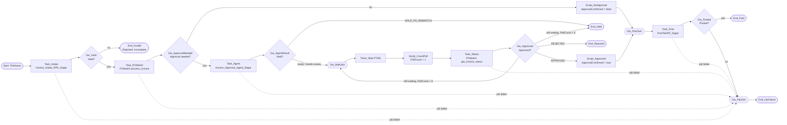

# Solution Design Document — InvoiceApprovalProcess_Sagar

> **Template:** Maestro BPMN — standards-based BPMN 2.0 process orchestration: pools/lanes, gateways, events, boundary timeouts, subprocesses, and multi-instance loops over RPA, agents, API workflows, connectors, and HITL.
> **Phase 2 sections:** §3, §4, §5, §6, §7, §8, §9, §12. **Phase 3 sections:** all others.
> **Data:** synthetic, USD only. Field names and format descriptions only — no sample amounts, tax IDs, tokens or signed URLs.

---

## Document History

| Date | Version | Author | Role | Comments |
|---|---|---|---|---|
| 2026-10-08 | 1.0 | uipath-planner | Generated by AI Agent | Initial SDD generated from `invoice-approval-pdd.md` and its gap analysis |

---

<!-- DO NOT RENAME: uipath-planner detects SDDs via this exact heading or the marker below. -->
<!-- planner-handoff:v1 -->
## Planner Handoff

| Field | Value |
|---|---|
| **Status** | ready |
| **Execution autonomy** | autonomous |
| **Delivery model** | cloud |
| **SDD scope** | solution |
| **Solution root SDD** | invoice-approval-solution-sdd.md |
| **Solution ID** | invoice-approval |
| **Project SDD role** | child |
| **Independently executable** | no — Lane A derives tasks only via the Solution root |
| **Project list section** | §4 Activities Inventory + §9 Integrated Components |
| **Tasks file** | `implementation-tasks.md` |
| **Generated by** | uipath-planner |
| **Generation date** | 2026-10-08 |
| **Template validation** | passed |

---

## Decisions Made

> Autonomous mode picked the architectural decisions below without a user checkpoint. Override by rerunning in Interactive mode or by editing the relevant SDD section.

| # | Decision | Picked | One-sentence reason |
|---|---|---|---|
| 1 | **Scope** (Level 1) | Solution child — Maestro BPMN orchestrator of 5 projects + coded functions | PDD §16: every step exists but nothing ties them into one tracked instance per invoice. |
| 2 | **Process trigger (start event)** | MANUAL_START (API / Orchestrator start with `FileName`) | PDD trigger is "invoice arrives"; one instance per file, started explicitly in this release. |

---

## Recommended Scope

**Recommendation:** SOLUTION(Maestro BPMN, RPA Process ×2, Agents ×2, Coded App; components: IXP model, Coded Functions, Data Fabric)
**Delivery model:** cloud
**Blocked by platform:** none
**Need profile:** Long-running, human-gated lifecycle across products; one instance per invoice reaching Paid, Rejected or Held.

---

## Action Required — SME Review Items

| # | Section | Item | Question | Default applied | Blocking |
|---|---|---|---|---|---|
| 1 | §5 | PDD Q1 | Approved-but-unmatched invoices? | Unmatched POs end *Held* before review; never posted. | no |
| 2 | §6 | PDD Q8 | Reviewer wait limit? | PT2M timer, max 6 polls (about 13 min), then *Held*. | no |
| 3 | §10 | PDD Q7 | ERP / portal retry policy? | 2 retries, 60 s apart, then *Operational Failure*. | no |
| 4 | §11 | Trigger | Should a bucket-upload event start instances? | Manual / API start in this release. | no |
| 5 | §12 Environments | UAT / PROD | Target tenants and folders? | *Training* tenant only. | no |

> These items are marked `[SME REVIEW]` in the document. Default-carried items (Blocking = no) do not block task derivation — the automation is built on the recorded defaults, which must be verified before production sign-off. Any Blocking = yes item keeps the handoff at `Status: draft`.

---

## Table of Contents

1. Process Overview
2. Process Diagram
3. Pools & Lanes
4. Activities Inventory
5. Gateways & Sequence Flows
6. Events
7. Data Objects & Variables
8. Subprocesses & Call Activities
9. Integrated Components
10. Error Handling & Retry
11. Triggers
12. Project Structure
13. Testing Strategy
14. Next Steps

---

## 1. Process Overview

| Field | Value |
|---|---|
| **Process name** | InvoiceApprovalProcess_Sagar (solution `InvoiceApprovalSolution_Sagar`) |
| **Objective** | Run one invoice from arrival to *Paid*, *Rejected (incomplete)*, *Rejected (reviewer)* or a clear *Held* / *Operational Failure* state, invoking the existing projects in PDD order. |
| **Department / Function** | Finance — Accounts Payable |
| **Trigger type** | MANUAL (API / Orchestrator start with input `FileName`) |
| **Expected execution volume** | [SME REVIEW] not stated in the PDD; lab volume is a handful of invoices per day |
| **Long-running characteristic** | Typical: minutes (auto-approved path) / Max: about 13 minutes of reviewer wait, then *Held* |
| **Source PDD** | `invoice-approval-pdd.md` |

### In Scope

- Start one instance per invoice file in bucket `InvoiceInbox_Sagar`.
- Invoke intake (steps 1–2), PO match (step 3), approval agent (step 4), bounded reviewer wait (step 5), posting (step 6).
- Implement decisions D1 `Valid?`, D2 `Approval needed?`, D3 `Approved?` plus the `Held?` route for unmatched POs and incomplete outcomes.
- Boundary error handling on every service task, ending in *Operational Failure*.

### Out of Scope

- The reviewer's user interface (ap-approval-review-sagar owns it; this process only reads the decision).
- Payment runs in the ERP; vendor notifications (PDD §13, Q9).
- Changing any business rule — rules live in the invoked components.

### Assumptions

- The five Lab processes and the POMatch functions are deployed in `Agentic Bootcamp/APAutomation_Sagar` and are linked (not copied) by the solution deploy configuration.
- `get_invoice_status` returns booleans with safe defaults (unset ApprovalNeeded → true, unset PostedToERP → false).
- The reviewer acts on the budget approver's behalf (PDD §3).

---

## 2. Process Diagram



---

## 3. Pools & Lanes

| Pool | Lane | Role / Participant | Owns Activities (node keys) | Notes |
|---|---|---|---|---|
| Invoice Approval | Automation | Maestro + serverless robot | `Task_Intake`, `Task_POMatch`, `Task_Agent`, `Task_Status`, `Task_Post`, scripts, gateways | All work is system-to-system. |
| Invoice Approval | AP Review | AP reviewer (for the budget approver) | — (decision recorded in the coded app) | Represented by the timer/poll loop, not a userTask. |
| Vendor | — | Vendor (external) | — | Sends the invoice; not modelled further (Q9). |
| ERP | — | ERP / AP portal (external) | reached via `Task_POMatch`, `Task_Post` | System of record for POs and payments. |

---

## 4. Activities Inventory

| # | Node Key | BPMN Element Type | Description | Inputs | Outputs | Integrated Component | Notes |
|---|---|---|---|---|---|---|---|
| 1 | `Event_start` | startEvent | Start one instance for one invoice file | `FileName` | — | — | Trigger type: MANUAL |
| 2 | `Task_Intake` | serviceTask | Extract, validate, de-duplicate, create record (PDD 1–2) | `FileName`, `CreateQueueItem=false` | `RecordId`, `IsValid`, `WasDuplicate`, `ErrorMessage` | RPA: `Invoice_Intake_RPA_Sagar` | Every context input `type="string"`; literal release key |
| 3 | `Gw_Valid` | exclusiveGateway | D1 Valid? | `VarIsValid` | — | — | §5 |
| 4 | `End_Invalid` | endEvent | Rejected: structurally incomplete | — | — | — | PDD E1 |
| 5 | `Task_POMatch` | serviceTask | Match PO, set PO Matched / Approval Needed (PDD 3) | `record_id` | `po_matched`, `approval_required`, `match_reason`, `error_type` | Coded Function: `POMatch_Sagar.process_invoice` | Outputs mapped per argument |
| 6 | `Gw_ApprovalNeeded` | exclusiveGateway | D2 Approval needed? | `VarApprovalRequired` | — | — | §5 |
| 7 | `Script_NoApproval` | scriptTask | Set `VarApprovalConfirmed=false` (auto-approved) | — | `VarApprovalConfirmed` | — | `BPMN.Variables` type, `custom="true"` output |
| 8 | `Task_Agent` | serviceTask | Build approval package + recommendation (PDD 4) | `recordId` | `recommendation`, `invoiceLifecycleState`, `approvalEvidenceState` | Agent: `Invoice_Approval_Agent_Sagar` | `Orchestrator.StartJob` with the agent release key |
| 9 | `Gw_AgentResult` | exclusiveGateway | Held? | `VarRecommendation` | — | — | HOLD_PO_MISMATCH → Held |
| 10 | `Gw_WaitJoin` | exclusiveGateway | Loop join for the review wait | — | — | — | converging |
| 11 | `Timer_Wait` | intermediateCatchEvent | Wait 2 minutes | — | — | — | `PT2M`; never faster |
| 12 | `Script_CountPoll` | scriptTask | `VarPollCount = VarPollCount + 1` | `VarPollCount` | `VarPollCount` | — | |
| 13 | `Task_Status` | serviceTask | Read reviewer decision (PDD 5) | `record_id` | `invoice_lifecycle_state`, `posted_to_erp`, `reviewed_by`, `reviewed_at` | Coded Function: `POMatch_Sagar.get_invoice_status` | |
| 14 | `Gw_Approved` | exclusiveGateway | D3 Approved? / still waiting | `VarLifecycleState`, `VarPollCount` | — | — | §5 |
| 15 | `Script_Approved` | scriptTask | Set `VarApprovalConfirmed=true` | — | `VarApprovalConfirmed` | — | |
| 16 | `End_Rejected` | endEvent | Rejected: reviewer decision | — | — | — | PDD E8 |
| 17 | `End_Held` | endEvent | Held: unmatched PO or no decision in time | — | — | — | PDD Q1 / Q8 defaults |
| 18 | `Gw_PostJoin` | exclusiveGateway | Converge auto-approved and approved paths | — | — | — | |
| 19 | `Task_Post` | serviceTask | Post in the AP portal and mark posted (PDD 6) | `RecordId`, `ApprovalConfirmed`, `PortalUrl` | `Posted`, `WasAlreadyPosted`, `PostingId`, `ErrorMessage` | RPA: `PostToERP_Sagar` | serverless runtime |
| 20 | `Gw_Posted` | exclusiveGateway | Posted? | `VarPosted` | — | — | |
| 21 | `End_Paid` | endEvent | Paid (submitted for payment) | — | — | — | |
| 22 | `Gw_FailJoin` | exclusiveGateway | Converge all failures | — | — | — | |
| 23 | `End_OpFailure` | endEvent | Operational Failure | — | — | — | Record left in its last valid state |

---

## 5. Gateways & Sequence Flows

### Gateways

| Gateway Key | Type | Incoming | Outgoing | Default Flow | Purpose |
|---|---|---|---|---|---|
| `Gw_Valid` | exclusive | `Task_Intake` | `Task_POMatch`, `End_Invalid` | `End_Invalid` | D1 — BR-3 (PO Number and Total Amount present) |
| `Gw_ApprovalNeeded` | exclusive | `Task_POMatch` | `Script_NoApproval`, `Task_Agent` | `Task_Agent` | D2 — BR-2; conservative default routes to approval |
| `Gw_AgentResult` | exclusive | `Task_Agent` | `End_Held`, `Gw_WaitJoin` | `Gw_WaitJoin` | Unmatched PO (Q1 default) ends Held |
| `Gw_WaitJoin` | exclusive (converging) | `Gw_AgentResult`, `Gw_Approved` | `Timer_Wait` | — | Poll loop |
| `Gw_Approved` | exclusive | `Task_Status` | `Script_Approved`, `End_Rejected`, `Gw_WaitJoin`, `End_Held` | `End_Held` | D3 + bounded wait |
| `Gw_PostJoin` | exclusive (converging) | `Script_NoApproval`, `Script_Approved` | `Task_Post` | — | BR-4 entry |
| `Gw_Posted` | exclusive | `Task_Post` | `End_Paid`, `Gw_FailJoin` | `Gw_FailJoin` | |
| `Gw_FailJoin` | exclusive (converging) | boundary errors, `Gw_Posted` | `End_OpFailure` | — | |

### Sequence Flows

| Flow Key | Source | Target | Condition Expression | Notes |
|---|---|---|---|---|
| `F_Valid_Yes` | `Gw_Valid` | `Task_POMatch` | `VarIsValid == true` | |
| `F_Valid_No` | `Gw_Valid` | `End_Invalid` | default | |
| `F_Appr_No` | `Gw_ApprovalNeeded` | `Script_NoApproval` | `VarPoMatched == true && VarApprovalRequired == false` | Auto-approved |
| `F_Appr_Yes` | `Gw_ApprovalNeeded` | `Task_Agent` | default | |
| `F_Held` | `Gw_AgentResult` | `End_Held` | `VarRecommendation == "HOLD_PO_MISMATCH"` | |
| `F_Wait` | `Gw_AgentResult` | `Gw_WaitJoin` | default | READY_FOR_APPROVAL or NEEDS_AP_REVIEW |
| `F_Approved` | `Gw_Approved` | `Script_Approved` | `VarLifecycleState == "APPROVED"` | |
| `F_Rejected` | `Gw_Approved` | `End_Rejected` | `VarLifecycleState == "REJECTED"` | |
| `F_Loop` | `Gw_Approved` | `Gw_WaitJoin` | state in {READY_FOR_APPROVAL, NEEDS_AP_REVIEW} `&& VarPollCount < 6` | |
| `F_Timeout` | `Gw_Approved` | `End_Held` | default | Wait exhausted |
| `F_Paid` | `Gw_Posted` | `End_Paid` | `VarPosted == true` | Includes `WasAlreadyPosted` |

---

## 6. Events

| Event Key | Event Kind | Definition | Attached To (boundary) | Interrupting? | Timer / Message / Error detail |
|---|---|---|---|---|---|
| `Event_start` | start | none | — | — | Input `FileName` |
| `Timer_Wait` | intermediate-catch | timer | — | — | `PT2M` duration [SME REVIEW] production cadence |
| `Err_Task_Intake` | boundary | error | `Task_Intake` | yes | Job failed → `Gw_FailJoin` |
| `Err_Task_POMatch` | boundary | error | `Task_POMatch` | yes | Job failed |
| `Err_Task_Agent` | boundary | error | `Task_Agent` | yes | Job failed |
| `Err_Task_Status` | boundary | error | `Task_Status` | yes | Job failed |
| `Err_Task_Post` | boundary | error | `Task_Post` | yes | Job failed |
| `End_Invalid`, `End_Rejected`, `End_Held`, `End_Paid`, `End_OpFailure` | end | none | — | — | Five named ends |

---

## 7. Data Objects & Variables

Variable ids carry no underscores (they are stripped at runtime).

| Name | Direction | Type | Scope | Default | Description |
|---|---|---|---|---|---|
| `FileName` | IN | string | process | — | Invoice file name in `InvoiceInbox_Sagar` |
| `VarRecordId` | — | string | process | "" | Data Fabric record Id from intake |
| `VarIsValid` | — | boolean | process | false | D1 result |
| `VarPoMatched` | — | boolean | process | false | BR-1 result |
| `VarApprovalRequired` | — | boolean | process | true | BR-2 result (conservative default) |
| `VarMatchReason` | — | string | process | "" | MATCHED / PO_NOT_FOUND / VENDOR_INACTIVE / OUTSIDE_TOLERANCE |
| `VarRecommendation` | — | string | process | "" | Approval agent recommendation |
| `VarLifecycleState` | — | string | process | "" | Last read `InvoiceLifecycleState` |
| `VarPollCount` | — | integer | process | 0 | Review-wait polls so far (max 6) |
| `VarApprovalConfirmed` | — | boolean | process | false | Passed to PostToERP |
| `VarPosted` | OUT | boolean | process | false | Posting result |
| `VarErrorMessage` | OUT | string | process | "" | Non-confidential error text |

Variables never hold VendorTaxId, TotalAmount, the approval package, the ERP URL or any token.

---

## 8. Subprocesses & Call Activities

### Subprocesses

| Subprocess Key | Kind | Nested Scope Summary | Scoped Variables | Multi-instance? |
|---|---|---|---|---|
| — | — | None: the review wait is a flat timer loop, kept visible for monitoring | — | no |

### Call Activities

| Call Activity Key | Invokes | Target Process | Input / Output Mapping |
|---|---|---|---|
| — | — | None: every component is a job (serviceTask), not a separate Maestro instance | — |

---

## 9. Integrated Components

### RPA Processes Invoked

| Process Name | Called From Node | Purpose |
|---|---|---|
| `Invoice_Intake_RPA_Sagar` | `Task_Intake` | Steps 1–2 (see `invoice-intake-rpa-sdd.md`) |
| `PostToERP_Sagar` | `Task_Post` | Step 6 (see `post-to-erp-sdd.md`) |

### Agents Invoked

| Agent Name | Called From Node | Purpose |
|---|---|---|
| `Invoice_Approval_Agent_Sagar` | `Task_Agent` | Step 4 (see `invoice-approval-agent-sdd.md`); started with `Orchestrator.StartJob` and its release key |
| `Invoice_Extraction_Agent_Sagar` | indirectly, via `Task_Intake` | Step 1 (see `invoice-extraction-agent-sdd.md`) |

### API Workflows Invoked

| API Workflow Name | Called From Node | Purpose |
|---|---|---|
| — | — | None — ERP access is inside the coded functions |

### Integration Service Connectors

| Connector | Called From Node | Operation |
|---|---|---|
| — | — | None — no IS connector exists for the mock ERP |

### Integration Service Connections

| Connector | System | Access Method | Used By |
|---|---|---|---|
| ERP PO lookup | ERP | Direct HTTP (inside `POMatch_Sagar`) | `Task_POMatch` |
| AP portal | ERP / AP portal | UI automation (inside `PostToERP_Sagar`) | `Task_Post` |

### Coded Functions

| Function | Called From Node | Input → Output (typed) | Purpose / Dependencies |
|---|---|---|---|
| `POMatch_Sagar.process_invoice` | `Task_POMatch` | `ProcessInvoiceInput{record_id, entity_name}` → `ProcessInvoiceOutput{record_id, po_matched, approval_required, open_amount, match_reason, error_type, error_message}` | Reads the record, calls ERP, applies BR-1/BR-2 (2% two-sided tolerance, > 10,000 USD threshold), writes POMatched / ApprovalNeeded. Needs process env var `ERP_PO_LOOKUP_URL`. |
| `POMatch_Sagar.get_invoice_status` | `Task_Status` | `InvoiceStatusInput{record_id, entity_name}` → `InvoiceStatusOutput{invoice_lifecycle_state, approval_needed, posted_to_erp, reviewed_by, reviewed_at, found, error_type}` | Read-only status for the poll loop; add `rejection_reason` passthrough once the field exists. |
| `POMatch_Sagar.po_lookup` | — (tool / test entry point) | `POLookupInput{vendor_name, po_number, invoice_total, currency}` → `POLookupOutput{po_matched, approval_required, open_amount, match_reason, error_type}` | Pure ERP lookup; reused by tests. |
| `POMatch_Sagar.process_invoice_queue` | — (batch path) | `ProcessQueueInput{queue_name, folder_path, entity_name, max_items}` → `ProcessQueueOutput{processed, matched, approval_required, failed, errors}` | Drains `InvoiceQueue_Sagar` outside BPMN; never leaves a transaction In Progress. |

### HITL Touchpoints

| Node Key | HITL Type | Purpose | Approval Criteria |
|---|---|---|---|
| `Task_Status` loop (external) | APPTASK (coded web app, polled) | AP reviewer approves or rejects in `ap-approval-review-sagar` | Reviewer reads package + recommendation; Approve / Reject enabled for READY_FOR_APPROVAL and NEEDS_AP_REVIEW; reject needs a reason |

---

## 10. Error Handling & Retry

| Scope | Mechanism | Trigger | Retry Policy | Action |
|---|---|---|---|---|
| Process-level | Unhandled exception | Any activity fails outside a boundary | none | End *Operational Failure*; record unchanged |
| Activity-level | boundary error event | Job Faulted on any serviceTask | [SME REVIEW] 2 retries, 60 s apart (Q7 default) | Route to `Gw_FailJoin` → `End_OpFailure` |
| Activity-level | error-mapping | Function returns non-empty `error_type` (e.g. ERP_UNREACHABLE) | same as above | Treat as failure; never assume matched |
| Activity-level | idempotency | Re-run after failure | — | Intake returns existing Id; agent retry guard; PostToERP `WasAlreadyPosted` |

A failed instance's Maestro job can still show Successful — monitor element executions, not only job state.

---

## 11. Triggers

| Trigger Type | Configuration | Notes |
|---|---|---|
| MANUAL START | `uip maestro bpmn process run` / Orchestrator start with `{"FileName": "<file in InvoiceInbox_Sagar>"}` | One instance per file |
| Storage-bucket event | [SME REVIEW] not in this release | Candidate for automatic start on upload |

---

## 12. Project Structure

```text
InvoiceApprovalSolution_Sagar/
├── InvoiceApprovalSolution_Sagar.uipx
└── InvoiceApprovalProcess_Sagar/
    ├── InvoiceApprovalProcess_Sagar.bpmn
    └── project.uiproj
```

`entry-points.json` (FileName input) and `bindings_v2.json` (name + folder path per process) are not derived by
pack or refresh; the BPMN specialist owns them. `resources/` must be checked for environment variables before
debug and pack, and packs checked for token values before publish.

### Orchestrator Deployment Target

- [ ] Development workspace (default — the specialist's own authoring/publish surface)
- [x] Orchestrator (`.uipx`-wrapped solution → `uipath-solution`; deploy config **links** the five Lab processes in `Agentic Bootcamp/APAutomation_Sagar` rather than installing copies)

### Solution / Project Breakdown

| Project | Product (RPA / API / Agent / …) | GitHub Repository | Folder | Attended / Unattended |
|---|---|---|---|---|
| InvoiceApprovalProcess_Sagar | Maestro BPMN | `UiPath-Coders/commercial_bootcamp_Sagar` (`lab10-maestro-bpmn/`) | new child of `Agentic Bootcamp/APAutomation_Sagar` | N-A |
| Invoice_Intake_RPA_Sagar | RPA | same repo (`lab2-rpa/`) | `Agentic Bootcamp/APAutomation_Sagar` | Unattended (serverless) |
| Invoice_Extraction_Agent_Sagar | Agent (low-code) | same repo (`lab2-rpa/`) | `…/APAutomation_Sagar/Invoice_Extraction_Agent_Sagar` | Unattended |
| POMatch_Sagar | Coded Functions | same repo (`lab3-api/`) | `Agentic Bootcamp/APAutomation_Sagar` | Unattended (serverless) |
| PostToERP_Sagar | RPA | same repo (`lab4-rpa/`) | `Agentic Bootcamp/APAutomation_Sagar` | Unattended (serverless) |
| Invoice_Approval_Agent_Sagar | Agent (coded) | same repo (`lab5-coded-agent/`) | `Agentic Bootcamp/APAutomation_Sagar` | Unattended |
| ap-approval-review-sagar | Coded App | same repo (`lab6-coded-app/`) | `Agentic Bootcamp/APAutomation_Sagar` | N-A (user app) |

### Reusable Components

| Type (reused / new-reusable) | Name | Details |
|---|---|---|
| reused | All five Lab processes + POMatch functions | Deployed and verified (PDD §16); linked by the solution |
| reused | `AP_Invoice_Sagar` entity | Tenant-scoped; one field added (`RejectionReason`) |

### Environments (DEV / UAT / PROD)

| Item | DEV | UAT | PROD | Used By |
|---|---|---|---|---|
| Orchestrator + Tenant/Service | `staging.uipath.com` / customersuccessamer / Training | [SME REVIEW] | [SME REVIEW] | All |
| Folder | `Agentic Bootcamp/APAutomation_Sagar` (+ solution child) | [SME REVIEW] | [SME REVIEW] | All |

### Non-Functional Requirements

| Dimension | Requirement / Design decision |
|---|---|
| **Security** | No confidential values in variables, logs or element outputs; signed ERP URL only as a process env var, cleared from solution resources before pack; least-privilege folder roles. |
| **Performance** | Serverless jobs; no Windows-license robots; timer never faster than PT2M (each poll starts a job). |
| **Scalability** | One instance per invoice; instances independent; [SME REVIEW] peak concurrency. |
| **Availability / Resilience** | Boundary errors on every task; idempotent components allow safe re-runs. |
| **Logging & Monitoring** | Element executions and `PollCount` monitored per instance; Orchestrator job logs; Maestro dashboards. |
| **Compliance** | Confidential AP data rules (PDD §11); audit via ReviewedBy / ReviewedAt. |

---

## 13. Testing Strategy

### Canonical Test Case

| Input Variable | Value |
|---|---|
| `FileName` | name of an unused synthetic invoice PDF in `InvoiceInbox_Sagar` whose PO matches and whose total is above the approval threshold |

### Happy Path Assertions

1. Exactly one `AP_Invoice_Sagar` record exists for the invoice after `Task_Intake`.
2. `POMatched = true`, `ApprovalNeeded = true` after `Task_POMatch`.
3. Recommendation READY_FOR_APPROVAL with evidence COMPLETE after `Task_Agent`.
4. After the reviewer approves in the app, the next poll routes to `Script_Approved`.
5. `Task_Post` returns `Posted = true`; record shows `PostedToERP = true`, `InvoiceLifecycleState = POSTED`; instance ends `End_Paid`.

### Gateway / Branch Coverage

| Gateway Key | Path | Setup | Expected Route |
|---|---|---|---|
| `Gw_Valid` | no | invoice without PO Number | `End_Invalid`, no record |
| `Gw_Valid` | yes | complete invoice | `Task_POMatch` |
| `Gw_ApprovalNeeded` | no | matched PO, total at or below threshold | `Script_NoApproval` → `Task_Post` |
| `Gw_ApprovalNeeded` | yes | total above threshold | `Task_Agent` |
| `Gw_AgentResult` | Held | PO not found or vendor inactive | `End_Held` |
| `Gw_Approved` | approved / rejected / loop / timeout | reviewer approves, rejects, or does nothing | `Script_Approved` / `End_Rejected` / loop / `End_Held` after 6 polls |
| `Gw_Posted` | yes / no | portal posts / portal error | `End_Paid` / `End_OpFailure` |

### Boundary-Event & Timeout Scenarios

| Event Key | Setup | Expected Behavior |
|---|---|---|
| `Timer_Wait` | no reviewer action | `PollCount` reaches 6 in about 13 minutes; instance ends `End_Held` |
| `Err_Task_POMatch` | expired `ERP_PO_LOOKUP_URL` | `End_OpFailure`; record keeps EXTRACTED; no token in logs |
| `Err_Task_Post` | portal unreachable | `End_OpFailure`; `PostedToERP` stays false |

### Error Path Scenarios

| Scenario | Setup | Expected Process Behavior |
|---|---|---|
| Duplicate file | start twice with the same invoice | second intake returns the existing Id; no second record; no second posting |
| Already posted | record already POSTED | `Task_Post` returns `WasAlreadyPosted = true`; ends `End_Paid` without a portal post (debug path) |

### End-to-End Orchestration Test

1. Start an instance with an approval-path invoice; approve it in the app (state the InvoiceNumber and VendorName of the row to approve).
2. Start an instance with an auto-approved invoice; confirm it skips the agent and posts.
3. Start an instance and reject in the app with a reason; confirm `End_Rejected` and no posting.
4. Confirm no other record changed to APPROVED / REJECTED during the run.

---

## 14. Next Steps

This SDD captures architecture and decisions. To generate the implementation task list and execute the build, load `uipath-planner` with the Solution root SDD path (this child is not independently executable):

> Load `uipath-planner`. SDD path: `invoice-approval-solution-sdd.md`.

The planner detects the `## Planner Handoff` header, parses §4 Activities Inventory and §9 Integrated Components, derives the per-skill task list (routing each task to `uipath-maestro-bpmn`, `uipath-functions`, `uipath-platform`, `uipath-solution`, etc. — the review loop stays inline with `uipath-maestro-bpmn`), writes `implementation-tasks.md` alongside this SDD, and emits live `TaskCreate` calls.

Implementation tasks **do not live in this SDD** — they live in the planner's output.

---

**End of Solution Design Document.**
