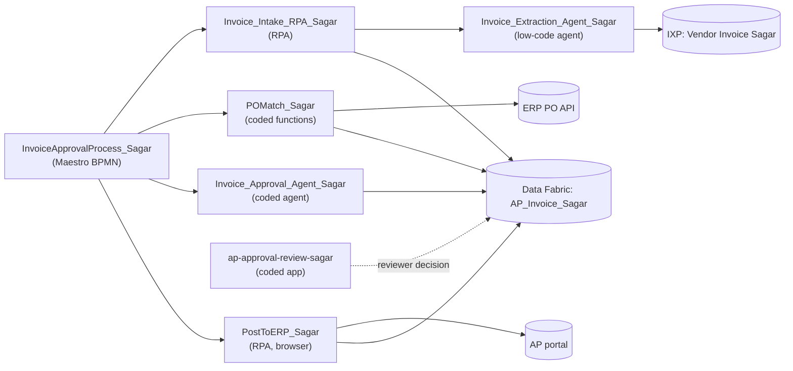

# Solution Design Document — Invoice Approval Solution (root)

> **Template:** Solution overview (uipath-planner, product-selection-guide → Solution overview SDD structure).
> **Source PDD:** `invoice-approval-pdd.md` (sections 1–15) and its gap analysis (section 16).
> **Data:** synthetic only, USD only. This document uses field names and format descriptions — never sample
> invoice amounts, tax IDs, bank details, tokens or signed URLs.

## 1. Solution Overview

| Field | Value |
|---|---|
| **Solution name** | Invoice Approval Solution |
| **Objective** | Take each vendor invoice from arrival to *Paid* (or a recorded *Rejected* end) with minimal manual keying, a complete approval package for every invoice that needs approval, and no duplicate posting. |
| **Business KPIs** | Manual entry effort, approval cycle time, early-payment discount capture, duplicate-payment rate (PDD §1). |
| **Process owner** | Accounts Payable |
| **Architecture style** | Agent-first, hybrid: agents interpret documents and assemble evidence; deterministic RPA and coded functions validate, match and post; a human reviewer decides; Maestro BPMN orchestrates one long-running instance per invoice. |
| **Delivery model** | Automation Cloud (tenant *Training*, `staging.uipath.com`) |
| **Orchestrator folder** | `Agentic Bootcamp/APAutomation_Sagar` (solution deployments create child folders beneath it) |
| **System of record** | Data Fabric entity `AP_Invoice_Sagar` — exactly one record per structurally valid invoice (PDD BR-5) |

### Business context

The PDD describes six steps and three decisions (`Valid?`, `Approval needed?`, `Approved?`) ending in two
Rejected ends and one Paid end. The gap analysis (PDD §16) shows steps 1–4 built and verified, steps 5–6 partially
evidenced, and **no end-to-end orchestration**. This solution design keeps every verified component, closes the
recorded gaps, and adds the BPMN process that ties the steps into one tracked instance per invoice.

---

<!-- DO NOT RENAME: uipath-planner detects SDDs via this exact heading or the marker below. -->
<!-- planner-handoff:v1 -->
## Planner Handoff

| Field | Value |
|---|---|
| **Status** | ready |
| **Execution autonomy** | autonomous |
| **Delivery model** | cloud |
| **SDD scope** | solution |
| **Solution root SDD** | invoice-approval-solution-sdd.md |
| **Solution ID** | invoice-approval |
| **Project SDD role** | root |
| **Project list section** | §3 Project Inventory + §6 Per-Project SDD Index |
| **Tasks file** | `implementation-tasks.md` |
| **Generated by** | uipath-planner |
| **Generation date** | 2026-10-08 |
| **Template validation** | passed |

**Cross-project ordering notes for Lane A** (integrated components before their consumers):

1. IXP model *Vendor Invoice Sagar* → Invoice_Extraction_Agent_Sagar → Invoice_Intake_RPA_Sagar.
2. Data Fabric entity change (add `RejectionReason`) → ap-approval-review-sagar, POMatch_Sagar `get_invoice_status`, Invoice_Approval_Agent_Sagar retry guard.
3. POMatch_Sagar (coded functions) → InvoiceApprovalProcess_Sagar process (BPMN).
4. Invoice_Approval_Agent_Sagar, PostToERP_Sagar, ap-approval-review-sagar → BPMN process.
5. BPMN process → solution pack / publish / deploy (`uipath-solution`) as the terminal artefact.
6. Existing, verified components (PDD §16) are **reuse-and-verify** tasks, not rebuilds.

---

## Decisions Made

> Autonomous mode picked the five architectural decisions below without a user checkpoint. Override by rerunning in Interactive mode (`Execution autonomy: interactive` in the Planner Handoff header above) or by editing the relevant SDD section.

| # | Decision | Picked | One-sentence reason |
|---|---|---|---|
| 1 | **Platform constraints** (Constraint Gate) | cloud; no products blocked | `uip login status` resolves to `staging.uipath.com`, an Automation Cloud host with the full catalog. |
| 2 | **Scope** (Level 1) | Solution(Maestro BPMN, RPA ×2, Agents ×2, Coded App; components: IXP model, Coded Functions, Data Fabric) | PDD names six steps across documents, ERP, portal and a human reviewer — separate buildable projects. |
| 3 | **RPA sub-type** (Level 1.5) | Process — Invoice_Intake_RPA_Sagar; Process — PostToERP_Sagar | Both are runnable end-to-end units started as jobs; neither is shared library code. |
| 4 | **Authoring mode** (Level 2) | XAML — both RPA projects | Bodies are activity orchestration (bucket, job, Data Fabric, browser UI) with little data shaping. |
| 5 | **Framework** | Sequence — both RPA projects | One invoice per job, started by the BPMN instance; transaction retry is owned by Maestro, not REFramework. |

## Recommended Scope

**Recommendation:** SOLUTION(Maestro BPMN, RPA Process ×2, Agents ×2 (low-code + coded), Coded App; integrated components: IXP model, Coded Functions, Data Fabric entity)
**Delivery model:** cloud
**Blocked by platform:** none
**Need profile:** Long-running, human-gated invoice-to-pay lifecycle over semi-structured documents, an ERP API and a UI-only AP portal; moves cycle time and duplicate-payment rate.

## Action Required — SME Review Items

| # | Section | Item | Question | Default applied | Blocking |
|---|---|---|---|---|---|
| 1 | §4 / BPMN §5 | PDD Q1 — approved but unmatched PO | May a reviewer approval override a failed PO match? | No. Unmatched invoices end *Held* (HOLD_PO_MISMATCH) for AP to correct the PO; BR-4 stays as written. | no |
| 2 | Coded App §6 | PDD Q5 — rejection reason | Where is the rejection reason stored? | New entity field `RejectionReason` (text), required on Reject in the review app. | no |
| 3 | BPMN §6 | PDD Q8 — reviewer wait | How long may an invoice wait for a decision? | Bounded wait: poll every 2 minutes, at most 6 polls (about 13 minutes), then end *Held* (lab cadence). Production value is an SME decision. | no |
| 4 | Intake RPA §4 | PDD Q4 — duplicate key | What identifies a duplicate invoice? | Invoice Number, as built (repeat returns the existing record). Vendor + Invoice Number recommended for production. | no |
| 5 | POMatch (BPMN §9) | PDD Q3 — tolerance direction | Does the 2% tolerance also cover under-billing? | Yes — two-sided, as built. | no |
| 6 | Approval Agent §3 | Required evidence | PDD BR-6 flags *any* missing input; the build requires 4 of 7 (GL Account, Cost Center, Approver, Receipt Reference). | Keep 4 required; the other 3 are shown but optional. | no |
| 7 | BPMN §10 | PDD Q7 — ERP retry | Retry count and backoff for ERP / portal outages? | 2 retries per job, 60 s apart, then *Operational Failure* end. | no |
| 8 | Root §5 | PDD Q9 — vendor notification | How is the vendor told about a rejection? | Out of scope for this release; the end state is recorded on the record. | no |
| 9 | Root §1 | PDD Q10 — KPI baselines | Baseline and target values for the KPIs? | Not set; measured from Orchestrator / Data Fabric timestamps after go-live. | no |
| 10 | Each child §16 / Environments | DEV / UAT / PROD | Which tenants and folders host UAT and PROD? | Single *Training* tenant for this lab; UAT/PROD not defined. | no |

> These items are marked `[SME REVIEW]` in the document. Default-carried items (Blocking = no) do not block task derivation — the automation is built on the recorded defaults, which must be verified before production sign-off. Any Blocking = yes item keeps the handoff at `Status: draft`.

---

## 3. Project Inventory

Unified project list (Level 2.5 Part B). **Build state** comes from the PDD §16 gap analysis.

| # | Project | Product | Role in the PDD | PDD steps | Build state (PDD §16) | Per-project SDD |
|---|---|---|---|---|---|---|
| 1 | `InvoiceApprovalProcess_Sagar` | Maestro BPMN | End-to-end orchestration, decisions D1–D3, bounded reviewer wait, three ends | 1–6, D1–D3 | Target-state only — not built | `invoice-approval-process-sdd.md` |
| 2 | `Invoice_Intake_RPA_Sagar` | RPA Process (XAML, Sequence) | Download invoice, call extraction, validate, de-duplicate, create the one record | 1, 2, D1 | Implemented and verified | `invoice-intake-rpa-sdd.md` |
| 3 | `Invoice_Extraction_Agent_Sagar` | Agent (low-code) | Read the eight invoice fields from the document via the IXP model | 1 | Implemented and verified | `invoice-extraction-agent-sdd.md` |
| 4 | `Invoice_Approval_Agent_Sagar` | Agent (coded, LangGraph) | Evaluate approval gates, build the approval package and recommendation | 4 | Implemented and verified | `invoice-approval-agent-sdd.md` |
| 5 | `ap-approval-review-sagar` | Coded App (web) | AP reviewer worklist; approve / reject with reviewer, timestamp and reason | 5, D3 | Partially implemented (no reason field, no rejection evidenced) | `ap-approval-review-sdd.md` |
| 6 | `PostToERP_Sagar` | RPA Process (XAML, Sequence, browser UI) | Post a ready invoice in the AP portal, mark it posted, never twice | 6 | Partially implemented (approved and auto-approved routes not evidenced) | `post-to-erp-sdd.md` |
| C1 | `Vendor Invoice Sagar` | IXP model (component) | Extraction model, live tag | 1 | Implemented and verified | hosted in `invoice-extraction-agent-sdd.md` |
| C2 | `POMatch_Sagar` | Coded Functions, Python (component) | `po_lookup`, `process_invoice`, `process_invoice_queue`, `get_invoice_status` | 3, status reads | Implemented and verified | hosted in `invoice-approval-process-sdd.md` |
| C3 | `AP_Invoice_Sagar` | Data Fabric entity (component) | The single invoice record; add `RejectionReason` | 2–6 | Implemented (27 fields); 1 field to add | described in §5 below |

---

## 4. Cross-Project Data Flow

| # | From | To | Mechanism | Payload (format, never values) | Notes |
|---|---|---|---|---|---|
| 1 | Invoice arrival | `InvoiceApprovalProcess_Sagar` | BPMN start with input `FileName` | file name (text) of a PDF in bucket `InvoiceInbox_Sagar` | Manual / API start in this release; storage-event trigger is a later option (BPMN §11). |
| 2 | BPMN `Task_Intake` | `Invoice_Intake_RPA_Sagar` | Orchestrator job (serverless) | in: `FileName`, `CreateQueueItem=false`; out: `RecordId`, `IsValid`, `WasDuplicate`, `ErrorMessage` | Queue item is not created when BPMN orchestrates; the queue path stays for batch use. |
| 3 | Intake RPA | `Invoice_Extraction_Agent_Sagar` | Run Job (agent process) | in: `SourceFile` (job attachment); out: the eight PDD fields | Agent runs in its solution sub-folder; folder path passed as an argument. |
| 4 | Extraction agent | IXP `Vendor Invoice Sagar` | Agent IXP tool, version tag `live` | document → field values | Model version 6 is live (PDD §16). |
| 5 | Intake RPA | `AP_Invoice_Sagar` | Data Fabric create | eight fields + `ProcessedTimestamp`, `InvoiceLifecycleState=EXTRACTED` | One record per Invoice Number (duplicate returns existing Id). |
| 6 | BPMN `Task_POMatch` | `POMatch_Sagar.process_invoice` | Orchestrator job (function) | in: `record_id`; out: `po_matched`, `approval_required`, `match_reason`, `error_type` | Writes `POMatched`, `ApprovalNeeded` to the record. |
| 7 | `POMatch_Sagar` | ERP PO lookup API | Direct HTTPS | vendor name, PO number, invoice total, currency → found, vendor active, open amount | URL comes from process environment variable `ERP_PO_LOOKUP_URL` (signed; never logged). |
| 8 | BPMN `Task_Agent` | `Invoice_Approval_Agent_Sagar` | Orchestrator job (agent) | in: `recordId`; out: `recommendation`, `approvalEvidenceState`, `missingApprovalFields`, `invoiceLifecycleState` | Writes package, recommendation, evidence state, `AgentProcessedAt`. |
| 9 | AP reviewer | `ap-approval-review-sagar` → `AP_Invoice_Sagar` | TypeScript SDK, user OAuth | `InvoiceLifecycleState` APPROVED / REJECTED, `ReviewedBy`, `ReviewedAt`, `RejectionReason` | Updates exactly one record by Id. |
| 10 | BPMN `Task_Status` | `POMatch_Sagar.get_invoice_status` | Orchestrator job (function), every 2 min | in: `record_id`; out: lifecycle state, approval needed, posted, reviewed by/at | Bounded poll (Root SME item 3). |
| 11 | BPMN `Task_Post` | `PostToERP_Sagar` | Orchestrator job (serverless, browser) | in: `RecordId`, `ApprovalConfirmed`, `PortalUrl`; out: `Posted`, `WasAlreadyPosted`, `PostingId`, `ErrorMessage` | Re-checks BR-4 against the record before posting. |
| 12 | PostToERP | `AP_Invoice_Sagar` | Data Fabric update | `PostedToERP=true`, `InvoiceLifecycleState=POSTED` | Duplicate-posting guard (PDD E9). |

### Lifecycle states on the record

`EXTRACTED` → (`AUTO_APPROVED` | `HOLD_PO_MISMATCH` | `NEEDS_AP_REVIEW` | `READY_FOR_APPROVAL`) → (`APPROVED` | `REJECTED`) → `POSTED`.
Agents and robots never downgrade `APPROVED`, `REJECTED` or `POSTED`.

---

## 5. Shared Assets & Queues

| Resource | Type | Scope | Used by | Notes |
|---|---|---|---|---|
| `AP_Invoice_Sagar` | Data Fabric entity (tenant-scoped) | Tenant | Intake RPA, POMatch, Approval Agent, Review App, PostToERP | 27 user fields today; **add** `RejectionReason` (text, ≤ 500 chars). VendorTaxId, TotalAmount and ApprovalPackageJson are confidential. |
| `InvoiceInbox_Sagar` | Storage bucket | `APAutomation_Sagar` | Intake RPA, BPMN start | Holds incoming invoice PDFs. |
| `InvoiceQueue_Sagar` | Queue | `APAutomation_Sagar` | Intake RPA (producer, batch mode), `process_invoice_queue` (consumer) | Kept for batch processing; the BPMN path calls `process_invoice` per record. |
| `ERP_PO_LOOKUP_URL` | Process environment variable | Processes `POMatch_Sagar_process_invoice`, `_process_invoice_queue`, `_po_lookup` | POMatch | Signed URL with an expiry; set on the process, never in source, logs, BPMN resources or packs. |
| `PortalUrl` | Job input argument | PostToERP | BPMN → PostToERP | The hosted AP portal URL; never a localhost URL. |
| AP portal sign-in | Credential | `APAutomation_Sagar` | PostToERP | `[SME REVIEW]` move to an Orchestrator credential asset (default: optional sign-in step, credential asset `AP_Portal_Credential`). |
| Serverless robot + machine | Runtime | Inherited from `Agentic Bootcamp` | All jobs | Never create machines, robots or roles. |
| IXP model `Vendor Invoice Sagar` | IXP project (tenant) | Tenant | Extraction agent | Version tag `live`. |

---

## 6. Per-Project SDD Index

| File | Project | Product | One-line scope |
|---|---|---|---|
| `invoice-approval-process-sdd.md` | `InvoiceApprovalProcess_Sagar` | Maestro BPMN | One instance per invoice: intake → Valid? → PO match → Approval needed? → package → bounded review wait → Approved? → post → Paid; hosts the POMatch coded functions. |
| `invoice-intake-rpa-sdd.md` | `Invoice_Intake_RPA_Sagar` | RPA Process | Downloads the file, runs the extraction agent, enforces BR-3, de-duplicates and creates the single record. |
| `invoice-extraction-agent-sdd.md` | `Invoice_Extraction_Agent_Sagar` | Agent (low-code) | Returns the eight PDD fields from one invoice document; hosts the IXP model. |
| `invoice-approval-agent-sdd.md` | `Invoice_Approval_Agent_Sagar` | Agent (coded) | Applies gates 1–4, writes evidence state, missing fields, recommendation and approval package; LLM only for the narrative. |
| `ap-approval-review-sdd.md` | `ap-approval-review-sagar` | Coded App | Reviewer worklist and decision panel; records reviewer, timestamp and rejection reason. |
| `post-to-erp-sdd.md` | `PostToERP_Sagar` | RPA Process | Posts a ready invoice through the AP portal and marks it posted, once. |

---

## 7. Next Steps

This root SDD and its six child SDDs are the agent-first architecture. Task derivation (Lane A) runs from **this
root only** — child SDDs are not independently executable.

> Load `uipath-planner`. SDD path: `invoice-approval-solution-sdd.md`.

Lane A reads the Project Inventory and SDD Index above, verifies each child (same Solution ID, `Status: ready`),
and writes the single canonical tasks file `implementation-tasks.md` in this folder. The terminal artefact is a
packed `.uipx` built with the `uipath-solution` skill (`uip solution init` → `projects add` per project →
`resources refresh` → `pack`), deployed as a new child folder under `Agentic Bootcamp/APAutomation_Sagar`.

---

**End of Solution Design Document.**
