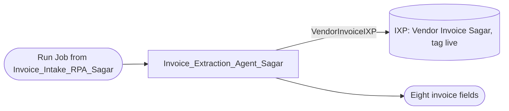

# Solution Design Document — Invoice_Extraction_Agent_Sagar

> **Template:** UiPath Agents (Python/coded or low-code). If chosen when the PDD lacked AI-specific details, gap-filling Q&A in Phase 1 should have filled: framework choice, tools, memory/RAG, evaluation criteria.
> **Phase 2 sections:** §2, §3, §4, §6, §9. **Phase 3 sections:** all others.
> **Data:** synthetic, USD only. Field names and format descriptions only — no sample amounts or tax IDs.

---

## Document History

| Date | Version | Author | Role | Comments |
|---|---|---|---|---|
| 2026-10-08 | 1.0 | uipath-planner | Generated by AI Agent | Initial SDD generated from `invoice-approval-pdd.md` and its gap analysis |

---

<!-- DO NOT RENAME: uipath-planner detects SDDs via this exact heading or the marker below. -->
<!-- planner-handoff:v1 -->
## Planner Handoff

| Field | Value |
|---|---|
| **Status** | ready |
| **Execution autonomy** | autonomous |
| **Delivery model** | cloud |
| **SDD scope** | solution |
| **Solution root SDD** | invoice-approval-solution-sdd.md |
| **Solution ID** | invoice-approval |
| **Project SDD role** | child |
| **Independently executable** | no — Lane A derives tasks only via the Solution root |
| **Project list section** | §9 Project Structure |
| **Tasks file** | `implementation-tasks.md` |
| **Generated by** | uipath-planner |
| **Generation date** | 2026-10-08 |
| **Template validation** | passed |

---

## Decisions Made

> Autonomous mode picked the architectural decisions below without a user checkpoint. Override by rerunning in Interactive mode or by editing the relevant SDD section.

| # | Decision | Picked | One-sentence reason |
|---|---|---|---|
| 1 | **Scope** (Level 1) | Solution child — low-code Agent hosting the IXP model | Vendor invoices are semi-structured and vary by vendor; PDD step 1 needs document interpretation. |
| 2 | **Agent framework** | Simple Function (low-code `agent.json`, single IXP tool call) | One document in, eight fields out — no multi-step reasoning or memory needed. |

---

## Recommended Scope

**Recommendation:** SOLUTION(Maestro BPMN, RPA Process ×2, Agents ×2, Coded App; components: IXP model, Coded Functions, Data Fabric)
**Delivery model:** cloud
**Blocked by platform:** none
**Need profile:** Read the eight PDD fields from any vendor invoice layout with no manual keying (PDD step 1, AC-1).

---

## Action Required — SME Review Items

| # | Section | Item | Question | Default applied | Blocking |
|---|---|---|---|---|---|
| 1 | §5 | Accuracy evidence | Is 5 validated documents enough for AC-1? | Keep F1 = 1.0 on the 5 training documents; add a held-out test set before production. | no |
| 2 | §1 | Volume | Invocations per day? | Lab volume (a handful per day). | no |

> These items are marked `[SME REVIEW]` in the document. Default-carried items (Blocking = no) do not block task derivation — the automation is built on the recorded defaults, which must be verified before production sign-off. Any Blocking = yes item keeps the handoff at `Status: draft`.

---

## Table of Contents

1. Agent Overview
2. Agent Framework
3. Tools
4. Memory / RAG
5. Evaluation Criteria
6. Orchestrator Bindings
7. Error Handling & Escalation
8. Integrated Components
9. Project Structure
10. Testing Strategy
11. Next Steps

---

## 1. Agent Overview

| Field | Value |
|---|---|
| **Agent name** | Invoice_Extraction_Agent_Sagar |
| **Role** | Invoice Extraction Agent |
| **Objective** | Return the eight PDD invoice fields from one invoice document using the IXP model. |
| **Trigger** | Run Job from `Invoice_Intake_RPA_Sagar` (`ProcessInvoiceFile.xaml`) with the file as `SourceFile` |
| **Expected LLM model** | `anthropic.claude-sonnet-4-6` (as configured in `agent.json`) |
| **Expected volume** | [SME REVIEW] one invocation per arriving invoice |
| **Source PDD** | `invoice-approval-pdd.md` (step 1, AC-1) |

### In Scope

- Call the IXP model (version tag `live`) on the input document.
- Return VendorName, VendorTaxId, InvoiceNumber, InvoiceDate, PONumber, TotalAmount, Currency, DueDate.

### Out of Scope

- Validation, de-duplication and record creation (intake RPA).
- Any decision about matching or approval.

### Assumptions

- IXP returns dates as `YYYY-MM-DDT00:00:00Z` and Total Amount as a bare decimal.
- One invoice per document (PDD assumption 1).

---

## 2. Agent Framework

**Selected framework:** Simple Function (low-code Agent Builder `agent.json`)

| Framework | Best For | Chosen? |
|---|---|---|
| Simple Function | Single-turn Q&A, no tool chaining | YES |
| LangGraph | Complex multi-step reasoning, state machines | NO |
| LlamaIndex | RAG-heavy agents, document search | NO |
| OpenAI Agents | OpenAI-native tool calling | NO |

**Justification:** The task is a single tool call followed by a typed output mapping. A low-code agent keeps the IXP tool configuration declarative (`resources/VendorInvoiceIXP/resource.json`) and deploys as its own solution.

---

## 3. Tools

| Tool Name | Tool Type | Repo / IS URL | Purpose | Input Schema | Output Schema |
|---|---|---|---|---|---|
| `VendorInvoiceIXP` | IXP extraction resource | `lab2-rpa/Invoice_Extraction_Agent_Sagar/.../resources/VendorInvoiceIXP/resource.json` | Extract fields from the invoice | `{ document: file }` | field group *Vendor Invoice* with eight fields |

### Tool Invocation Policy

- `VendorInvoiceIXP`: use exactly once per run, on `SourceFile`; never call it on other documents.

### Agent Configuration

| Field | Value |
|---|---|
| **Agent type** | FUNCTIONAL |
| **Primary function** | Document → eight typed invoice fields |
| **Agent hosting** | CLOUD (staging) |
| **Arguments — in** | `SourceFile: file (job attachment)` |
| **Arguments — out** | `VendorName, VendorTaxId, InvoiceNumber, InvoiceDate, PONumber, TotalAmount, Currency, DueDate: string` |

### Agent Interaction Diagram



---

## 4. Memory / RAG

### Short-term Memory

- [ ] Required
- [x] Not required

**Purpose:** NONE

### Long-term Memory

- [ ] Required (via UiPath memory service or external store)
- [x] Not required

**Purpose:** NONE

### RAG Sources

| Source Name | Type | Description | Indexing Strategy |
|---|---|---|---|
| — | — | Not required | — |

---

## 5. Evaluation Criteria

### Success Metrics

| Metric | Target | Measurement |
|---|---|---|
| Field F1 (per field) | 1.0 on the validated set; ≥ 0.95 on a held-out set [SME REVIEW] | `uip ixp projects get-metrics` |
| Output completeness | 8 of 8 keys present every run | eval set assertion |
| Confidential leakage | 0 tax IDs / amounts in job logs | log inspection |

### Trajectory Evaluation

| Test Case | Expected Tool Sequence | Acceptable Variations |
|---|---|---|
| Standard invoice | VendorInvoiceIXP → output | none |

### LLM-Judge Criteria

| Criterion | Description | Pass Threshold |
|---|---|---|
| Field fidelity | Each output equals the document value (dates compared as dates) | exact match per field |

---

## 6. Orchestrator Bindings

| Binding Name | Resource Type | Purpose |
|---|---|---|
| `VendorInvoiceIXP` | IXP project `Vendor Invoice Sagar`, version tag `live` | Extraction model (`guardrail.policies []`) |
| Solution folder | PROCESS | Deployed in `Agentic Bootcamp/APAutomation_Sagar/Invoice_Extraction_Agent_Sagar` |

---

## 7. Error Handling & Escalation

### Agent-level errors

| Error Scenario | Handling |
|---|---|
| Tool invocation fails | RETURN_ERROR — job faults; intake faults; BPMN boundary handles retry |
| LLM refuses or returns invalid output | RETURN_ERROR — missing keys make intake reject as structurally incomplete |
| Rate limit hit | Platform backoff; [DEFAULT] no custom retry |

### HITL Escalation

| Scenario | Escalation Type | Who Resolves |
|---|---|---|
| Low-confidence extraction | None in this release — the AP reviewer sees every approval-path record in the review app | AP reviewer |

**Note:** No HITL escalation is wired in this agent; human review happens downstream in `ap-approval-review-sagar`.

---

## 8. Integrated Components

### RPA Processes Called as Tools

| Process Name | Tool Name | Purpose |
|---|---|---|
| — | — | None |

### API Workflows Called as Tools

| API Workflow Name | Tool Name | Purpose |
|---|---|---|
| — | — | None |

### Integration Service Connectors

| Connector | Tool Name | Operation |
|---|---|---|
| — | — | None |

### Integration Service Connections

| Connector | System | Access Method | Used By |
|---|---|---|---|
| — | — | None | — |

### IXP / Document Understanding Models

| Model / Project | Used By Tool | Document Types | Purpose |
|---|---|---|---|
| `Vendor Invoice Sagar` (`vendor-invoice-sagar-4113ba41-ixp`) | `VendorInvoiceIXP` | Vendor invoice PDF | Field group *Vendor Invoice*: Vendor Name, Vendor Tax ID, Invoice Number, Invoice Date, PO Number, Total Amount, Currency, Due Date. Model version 6 (gemini_ixp) tagged `live`; 5 validated documents, F1 = 1.0 on all fields (PDD §16). Retraining happens on label confirmation; after publishing, latest = live. |

---

## 9. Project Structure

### Implementation Mode

- [ ] **Coded Agent** (Python) — recommended for complex logic, custom frameworks
- [x] **Low-code Agent** (agent.json via Agent Builder) — recommended for simple agents

### Coded Agent Structure

Not used — this is a low-code agent.

### Low-code Agent Structure

```text
Invoice_Extraction_Agent_Sagar/
├── Invoice_Extraction_Agent_Sagar.uipx
└── Invoice_Extraction_Agent_Sagar/
    ├── agent.json
    ├── entry-points.json
    ├── bindings_v2.json
    ├── project.uiproj
    ├── evals/
    │   ├── eval-sets/evaluation-set-default.json
    │   └── evaluators/
    └── resources/VendorInvoiceIXP/resource.json
```

### Solution / Project Breakdown

| Project | Product (RPA / API / Agent / …) | GitHub Repository | Folder | Attended / Unattended |
|---|---|---|---|---|
| Invoice_Extraction_Agent_Sagar | Agent (low-code) | `UiPath-Coders/commercial_bootcamp_Sagar` (`lab2-rpa/`) | `Agentic Bootcamp/APAutomation_Sagar/Invoice_Extraction_Agent_Sagar` | Unattended |
| Vendor Invoice Sagar | IXP model (component) | tenant IXP project | tenant | N-A |

### Reusable Components

| Type (reused / new-reusable) | Name | Details |
|---|---|---|
| reused | IXP project `Vendor Invoice Sagar` | Live v6; consumed only by this agent |

### Environments (DEV / UAT / PROD)

| Item | DEV | UAT | PROD | Used By |
|---|---|---|---|---|
| Orchestrator + Tenant/Service | staging / customersuccessamer / Training | [SME REVIEW] | [SME REVIEW] | This agent |
| Folder | `…/APAutomation_Sagar/Invoice_Extraction_Agent_Sagar` | [SME REVIEW] | [SME REVIEW] | This agent |

### Non-Functional Requirements

| Dimension | Requirement / Design decision |
|---|---|
| **Security** | Output contains VendorTaxId and TotalAmount: job output is visible only to folder users; never echoed into logs or chat |
| **Performance** | One IXP call per document |
| **Scalability** | Serverless agent jobs, one per invoice |
| **Availability / Resilience** | Caller-owned retry (BPMN boundary on intake) |
| **Logging & Monitoring** | Agent traces; eval pass rate |
| **Compliance** | PDD §11 |

---

## 10. Testing Strategy

### Canonical Test Case

| Input | Expected Output |
|---|---|
| A synthetic invoice PDF from `lab2-rpa/` | Eight fields equal to the expected extractions in `lab1-ixp` (dates compared as dates; amount as decimal) |

### Evaluation Dataset

| Test ID | Input | Expected Trajectory | LLM-Judge Criteria |
|---|---|---|---|
| T-01 | each of the 5 synthetic invoices | VendorInvoiceIXP → output | field fidelity, 8 of 8 keys |
| T-02 | invoice with no PO Number | VendorInvoiceIXP → output | PONumber empty (intake then rejects) |
| T-03 | non-invoice PDF | VendorInvoiceIXP → output | fields empty; no hallucinated values |

### Regression Strategy

- Run evaluation dataset on every code change
- Track pass rate over time
- Any drop below 100% field fidelity on T-01 blocks deployment

---

## 11. Next Steps

This SDD captures architecture and decisions. To generate the implementation task list and execute the build, load `uipath-planner` with the Solution root SDD path (this child is not independently executable):

> Load `uipath-planner`. SDD path: `invoice-approval-solution-sdd.md`.

The planner detects the `## Planner Handoff` header, parses the project structure, derives the per-skill task list (routing each task to `uipath-agents`, `uipath-ixp`, `uipath-platform`, etc.), writes `implementation-tasks.md` alongside this SDD, and emits live `TaskCreate` calls. If `Execution autonomy: interactive`, it enters plan mode for task review before execution.

Implementation tasks **do not live in this SDD** — they live in the planner's output.

---

**End of Solution Design Document.**
