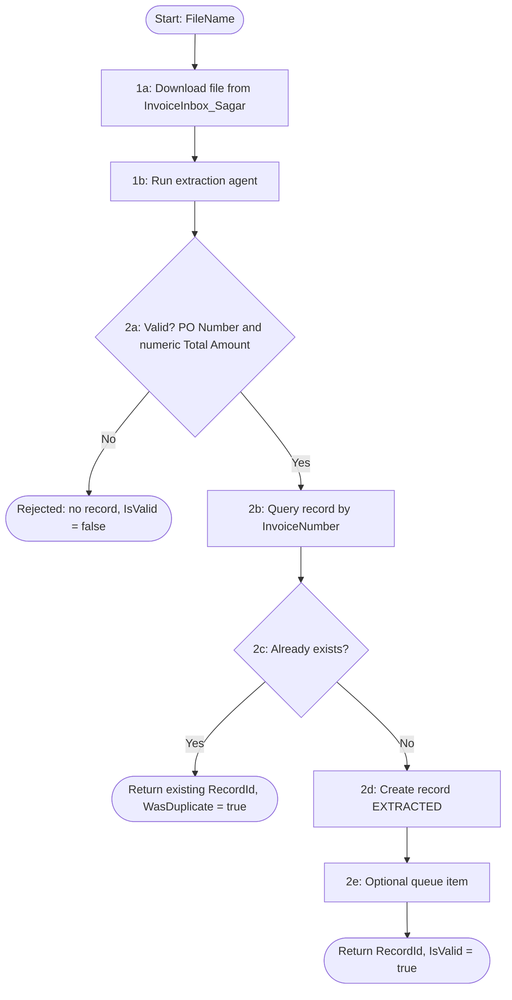

# Solution Design Document — Invoice_Intake_RPA_Sagar

> **Template:** RPA Process / Library / Test Automation.
> **Phase 2 sections:** §5, §9, §10, §11, §12, §13, §14. **Phase 3 sections:** all others.
> **Data:** synthetic, USD only. Field names and format descriptions only — no sample amounts or tax IDs.

---

## Document History

| Date | Version | Author | Role | Comments |
|---|---|---|---|---|
| 2026-10-08 | 1.0 | uipath-planner | Generated by AI Agent | Initial SDD generated from `invoice-approval-pdd.md` and its gap analysis |

---

<!-- DO NOT RENAME: uipath-planner detects SDDs via this exact heading or the marker below. -->
<!-- planner-handoff:v1 -->
## Planner Handoff

| Field | Value |
|---|---|
| **Status** | ready |
| **Execution autonomy** | autonomous |
| **Delivery model** | cloud |
| **SDD scope** | solution |
| **Solution root SDD** | invoice-approval-solution-sdd.md |
| **Solution ID** | invoice-approval |
| **Project SDD role** | child |
| **Independently executable** | no — Lane A derives tasks only via the Solution root |
| **Project list section** | §11 |
| **Tasks file** | `implementation-tasks.md` |
| **Generated by** | uipath-planner |
| **Generation date** | 2026-10-08 |
| **Template validation** | passed |

---

## Decisions Made

> Autonomous mode picked the five architectural decisions below without a user checkpoint. Override by rerunning in Interactive mode or by editing the relevant SDD section.

| # | Decision | Picked | One-sentence reason |
|---|---|---|---|
| 1 | **Platform constraints** (Constraint Gate) | cloud; no products blocked | Session host is Automation Cloud (staging). |
| 2 | **Scope** (Level 1) | Solution child — RPA Process | Deterministic intake and validation between a bucket, an agent and Data Fabric. |
| 3 | **RPA sub-type** (Level 1.5) | Process | Started as a job per invoice; not shared code. |
| 4 | **Authoring mode** (Level 2) | XAML | Activity orchestration (bucket download, Run Job, Data Fabric) with light parsing only. |
| 5 | **Framework** | Sequence | One file per job, invoked by BPMN; retries are owned by the caller. |

---

## Recommended Scope

**Recommendation:** SOLUTION(Maestro BPMN, RPA Process ×2, Agents ×2, Coded App; components: IXP model, Coded Functions, Data Fabric)
**Delivery model:** cloud
**Blocked by platform:** none
**Need profile:** Turn one invoice file into exactly one validated invoice record without manual keying (PDD steps 1–2).

---

## Action Required — SME Review Items

| # | Section | Item | Question | Default applied | Blocking |
|---|---|---|---|---|---|
| 1 | §4 BR-04 | Duplicate key (PDD Q4) | Invoice Number alone, or Vendor + Invoice Number? | Invoice Number, as built. | no |
| 2 | §7 B1 | Vendor notification (PDD Q9) | How is the vendor told about a rejected incomplete invoice? | Not built; reason is logged (file name + reason only) and returned to the caller. | no |
| 3 | §7 B3 | Other missing fields (PDD Q6) | How is AP alerted when optional fields are missing? | Record is created; missing optional dates stay empty and are visible in the review app. | no |
| 4 | §16 | UAT / PROD environments | Target tenants and folders? | *Training* tenant only. | no |

> These items are marked `[SME REVIEW]` in the document. Default-carried items (Blocking = no) do not block task derivation — the automation is built on the recorded defaults, which must be verified before production sign-off. Any Blocking = yes item keeps the handoff at `Status: draft`.

---

## Table of Contents

1. Process Overview
2. Process Map
3. Detailed Process Steps
4. Business Rules
5. Data Definitions
6. Value Mappings
7. Exception Handling
8. Error Handling
9. Application Inventory
10. Master Project Architecture
11. Project Structure
12. Queue Architecture
13. Implementation Mode
14. Packages
15. Credentials & Assets
16. Deployment Environment
17. Testing Strategy
18. Next Steps

---

## 1. Process Overview

| Field | Value |
|---|---|
| **Process name** | Invoice_Intake_RPA_Sagar |
| **Objective** | Download one invoice file, obtain the eight PDD fields from the extraction agent, enforce structural validity, and create (or return) the single invoice record. |
| **Department / Function** | Finance — Accounts Payable intake |
| **Schedule** | On demand: one job per invoice, started by `InvoiceApprovalProcess_Sagar` (or manually for batch) |
| **Volume** | [SME REVIEW] not stated in the PDD (peak: unknown) |
| **Avg. handling time (manual)** | [SME REVIEW] not stated in the PDD |
| **Avg. handling time (automated target)** | [DEFAULT] under 2 minutes per invoice including the agent job |
| **Exception rate** | [SME REVIEW] not stated in the PDD |
| **Source PDD** | `invoice-approval-pdd.md` (steps 1–2, D1, BR-3, BR-5, E1, E2, E10) |

### Delivery Team

| Role | Name | Contact |
|---|---|---|
| SME / Process Owner | Accounts Payable (PDD) | — |

### In Scope

- Download the named file from bucket `InvoiceInbox_Sagar`.
- Run `Invoice_Extraction_Agent_Sagar` on the file and read its eight output fields.
- Reject structurally incomplete invoices (missing PO Number, or Total Amount missing / not numeric).
- Look up the record by Invoice Number; return the existing Id on a duplicate.
- Create one `AP_Invoice_Sagar` record with `InvoiceLifecycleState = EXTRACTED` and `ProcessedTimestamp`.
- Optionally add a queue item to `InvoiceQueue_Sagar` (batch mode only).

### Out of Scope

- PO matching and approval decisions (POMatch, approval agent).
- Returning the invoice to the vendor (PDD Q9).
- Field-level extraction logic (owned by the extraction agent / IXP model).

### Assumptions

- The extraction agent returns field values as text; Total Amount is a bare decimal and dates are ISO date-time strings.
- All invoices are USD (PDD assumption 2).
- The caller passes `CreateQueueItem = false` when BPMN orchestrates, so the record is not processed twice.

---

## 2. Process Map



| Step | Description | Application |
|---|---|---|
| 1a | Download invoice file | Orchestrator storage bucket |
| 1b | Extract eight fields | Invoice_Extraction_Agent_Sagar (job) |
| 2a | Structural validation (D1) | — (in-workflow) |
| 2b–2c | Duplicate lookup | Data Fabric |
| 2d | Create record | Data Fabric |
| 2e | Queue item (batch mode) | Orchestrator queue |

---

## 3. Detailed Process Steps

### Step Summary

| # | Action | Application | Input | Output | Rules | Errors |
|---|---|---|---|---|---|---|
| 1a | Download file to a unique temp path (Retry Scope) | Storage bucket | `FileName`, bucket name/folder | local file | — | E1 |
| 1b | Run Job of the extraction agent in its solution folder | Orchestrator | local file as job attachment, agent folder path | eight fields | BR-01 | E2 |
| 2a | Clean Total Amount, build the validation error | — | eight fields | `IsValid`, `ErrorMessage` | BR-02, BR-03 | B1 |
| 2b | Parse amount and optional dates | — | text fields | typed values | BR-05, BR-06 | B3 |
| 2c | Query `AP_Invoice_Sagar` by InvoiceNumber | Data Fabric | InvoiceNumber | existing Id or none | BR-04 | B2, E3 |
| 2d | Create record | Data Fabric | typed values | new `RecordId` | BR-07, BR-08 | E3 |
| 2e | Add queue item if requested | Orchestrator queue | `RecordId` | queue item | BR-09 | E4 |

### Step Details

#### Step 2a — Structural validation

The invoice is valid only when PO Number is not blank **and** Total Amount is present and parses as a decimal after
removing currency symbols and thousands separators. Invalid invoices create **no** record and **no** queue item;
the job returns `IsValid = false` and a reason that names the missing field (never its value).

---

## 4. Business Rules

| ID | Rule Name | Description | Trigger Condition | Validation (regex / range / type / allowed values) | Affected Steps |
|---|---|---|---|---|---|
| BR-01 | Eight fields captured | Extraction returns VendorName, VendorTaxId, InvoiceNumber, InvoiceDate, PONumber, TotalAmount, Currency, DueDate | Every run | all eight keys present in the agent output (values may be empty) | 1b |
| BR-02 | PO Number present (PDD BR-3) | Reject when PO Number is blank | After extraction | `not IsNullOrWhiteSpace(PONumber)` | 2a |
| BR-03 | Total Amount present and numeric (PDD BR-3) | Reject when Total Amount is blank or not a decimal | After extraction | decimal, 2 dp, within entity range ±1e12 | 2a |
| BR-04 | One record per invoice (PDD BR-5) | A record with the same InvoiceNumber is reused, never duplicated | Before create | InvoiceNumber exact match; string 1–200 chars | 2c |
| BR-05 | Invoice Date | Optional; stored as a date | When present | ISO date `^\d{4}-\d{2}-\d{2}` (time part ignored) | 2b |
| BR-06 | Due Date | Optional; stored as a date | When present | ISO date `^\d{4}-\d{2}-\d{2}` | 2b |
| BR-07 | Currency | Stored as extracted | Every create | `^[A-Z]{3}$`; USD expected | 2d |
| BR-08 | Initial lifecycle | New records start EXTRACTED with ProcessedTimestamp = now (UTC) | Every create | `InvoiceLifecycleState ∈ {EXTRACTED}`; DATETIME_WITH_TZ | 2d |
| BR-09 | Queue only on request | Add a queue item only when `CreateQueueItem = true` | After create | boolean | 2e |
| BR-10 | Confidential logging | Logs carry file name, record Id and reason only — never tax ID or amount | All steps | n/a (behavioural) | all |

---

## 5. Data Definitions

### Option B — XAML Mode

#### Transaction Data (Dictionary)

| Key | Type | Source | Description |
|---|---|---|---|
| `FileName` | String | Job input | Invoice file name in the bucket |
| `VendorName` | String | Extraction agent | Vendor name |
| `VendorTaxId` | String | Extraction agent | Confidential; stored, never logged |
| `InvoiceNumber` | String | Extraction agent | Duplicate key |
| `InvoiceDate` | String → DateTime? | Extraction agent | Optional |
| `PONumber` | String | Extraction agent | Required |
| `TotalAmount` | String → Decimal | Extraction agent | Required; confidential |
| `Currency` | String | Extraction agent | ISO 4217 code |
| `DueDate` | String → DateTime? | Extraction agent | Optional |

#### Output Data (Dictionary)

| Key | Type | Description |
|---|---|---|
| `RecordId` | String | Data Fabric record Id (new or existing) |
| `IsValid` | Boolean | D1 result |
| `WasDuplicate` | Boolean | True when an existing record was returned |
| `ErrorMessage` | String | Reason for rejection or failure (no confidential values) |
| `ProcessedCount` / `CreatedCount` / `RejectedCount` | Int32 | Batch counters when run over several files |

#### Status/Category Values

| Variable | Allowed Values |
|---|---|
| `InvoiceLifecycleState` (on create) | EXTRACTED |

---

## 6. Value Mappings

### Extraction output — agent JSON to `AP_Invoice_Sagar`

| Source Value | Target Value |
|---|---|
| `VendorName` | `VendorName` (STRING 200) |
| `VendorTaxId` | `VendorTaxId` (STRING 200) |
| `InvoiceNumber` | `InvoiceNumber` (STRING 200) |
| `InvoiceDate` (ISO date-time) | `InvoiceDate` (DATE) |
| `PONumber` | `PONumber` (STRING 200) |
| `TotalAmount` (text) | `TotalAmount` (DECIMAL, 2 dp) |
| `Currency` | `Currency` (STRING 200) |
| `DueDate` (ISO date-time) | `DueDate` (DATE) |

---

## 7. Exception Handling

| ID | Exception Name | Trigger Step | Trigger Condition | Action |
|---|---|---|---|---|
| B1 | Structurally incomplete (PDD E1) | 2a | PO Number blank or Total Amount missing / non-numeric | No record, no queue item; `IsValid = false`; reason returned |
| B2 | Duplicate invoice (PDD E10) | 2c | InvoiceNumber already exists | Return existing `RecordId`, `WasDuplicate = true`; no create |
| B3 | Optional field missing (PDD E2) | 2b | Invoice Date / Due Date / other optional field empty or unparseable | Create the record with the field empty [SME REVIEW] alert rule (Q6) |

**Default handler:** For any unanticipated business exception, return `IsValid = false` with a non-confidential reason and create nothing.

---

## 8. Error Handling

| ID | Error Name | Trigger Step | Trigger Condition | Retry Policy | Action |
|---|---|---|---|---|---|
| E1 | Bucket download failed | 1a | File missing or storage error | Retry Scope ×3, 5 s [DEFAULT] | Fault the job with a clear message |
| E2 | Extraction agent job failed | 1b | Agent job Faulted / timed out | none in workflow (BPMN boundary owns retry) | Fault the job |
| E3 | Data Fabric read/write failed | 2c–2d | HTTP error from Data Service | none (caller retries; BR-04 makes re-runs safe) | Fault the job |
| E4 | Queue add failed | 2e | Orchestrator error | none | Fault the job; record already exists, re-run returns it |

**Default handler:** For any unanticipated system error, log the file name and error type (no confidential values) and fault the job so the BPMN boundary event routes to *Operational Failure*.

---

## 9. Application Inventory

| # | Application | Interface | Access Method | Role | Interaction Pattern | Session Management |
|---|---|---|---|---|---|---|
| 1 | Orchestrator storage bucket `InvoiceInbox_Sagar` | API | Orchestrator activities | SOURCE | READ | PER_RUN |
| 2 | `Invoice_Extraction_Agent_Sagar` | API | Orchestrator Run Job | UTILITY | READ-WRITE | PER_RUN |
| 3 | Data Fabric entity `AP_Invoice_Sagar` | API | Data Service activities (entity store in project) | TARGET | READ-WRITE | PER_RUN |
| 4 | Orchestrator queue `InvoiceQueue_Sagar` | API | Orchestrator activities | TARGET | WRITE | PER_RUN |

### Interactive Authentication / Re-auth Handoff

Not applicable — no human-only sign-in; all access uses the robot's Orchestrator identity.

### Integration Service Connections

| Connector | System | Access Method | Used By |
|---|---|---|---|
| — | — | None — all systems are UiPath platform services | — |

### IXP / Document Understanding Models

| Model / Project | Called From Workflow / Step | Document Types | Purpose |
|---|---|---|---|
| `Vendor Invoice Sagar` (indirect) | `ProcessInvoiceFile.xaml` step 1b, via the extraction agent | Vendor invoice PDF | Field extraction; hosted in `invoice-extraction-agent-sdd.md` |

---

## 10. Master Project Architecture

### Option B — Single Project

**Decomposition signals matched:** 0-1 (threshold not met)

> Single project. §12 applies because the project produces queue items in batch mode.

---

## 11. Project Structure

### Solution / Project Breakdown

| Project | Product (RPA / API / Agent / …) | GitHub Repository | Folder | Attended / Unattended |
|---|---|---|---|---|
| Invoice_Intake_RPA_Sagar | RPA | `UiPath-Coders/commercial_bootcamp_Sagar` (`lab2-rpa/Invoice_Intake_RPA_Sagar`) | `Agentic Bootcamp/APAutomation_Sagar` | Unattended (serverless) |

Other solution projects: see `invoice-approval-solution-sdd.md` §3.

### Reusable Components

| Type (reused / new-reusable) | Name | Details |
|---|---|---|
| reused | `Invoice_Extraction_Agent_Sagar` | Deployed agent v1.0.0, called by Run Job |
| reused | `AP_Invoice_Sagar` entity store | `.entities/` store registered in `project.json` |

### Project Type

| # | Project Name | Sub-type |
|---|---|---|
| 1 | `Invoice_Intake_RPA_Sagar` | Process |

### Project Mode Decision

| # | Project | Type | Compatibility | Authoring | Attendance | Initiation | Framework | Persistence (long-running) | Packaging |
|---|---|---|---|---|---|---|---|---|---|
| 1 | `Invoice_Intake_RPA_Sagar` | Process | Cross-platform (Portable, VB) | XAML | Unattended | API (BPMN serviceTask) / Manual | Sequence | NO | Solution (.uipx) — linked by `InvoiceApprovalSolution_Sagar` |

### Recommended Structure

```text
Invoice_Intake_RPA_Sagar/
├── project.json
├── project.uiproj
├── Main.xaml
├── ProcessInvoiceFile.xaml
└── .entities/EntitiesStore.json
```

### Workflow Inventory

| # | Workflow File | Responsibility | PDD Steps | Inputs | Outputs |
|---|---|---|---|---|---|
| 1 | `Main.xaml` | Entry point; one file or a batch | 1–2 | `FileName: String`, `CreateQueueItem: Boolean` | `RecordId: String`, `IsValid: Boolean`, `WasDuplicate: Boolean`, `ErrorMessage: String`, `ProcessedCount/CreatedCount/RejectedCount: Int32` |
| 2 | `ProcessInvoiceFile.xaml` | Download, extract, validate, de-duplicate, create, queue | 1a–2e | `in_FileName`, `in_BucketName`, `in_BucketFolderPath`, `in_AgentProcessName`, `in_AgentFolderPath`, `in_QueueName`, `in_QueueFolderPath`: String; `in_CreateQueueItem`: Boolean | `out_RecordId`, `out_ErrorMessage`: String; `out_IsValid`, `out_WasDuplicate`: Boolean |

### Workflow Dependencies

```text
Main.xaml
└── calls ProcessInvoiceFile.xaml
```

---

## 12. Queue Architecture

### Queue Definitions

| Queue Name | Producer Project | Consumer Project | Trigger Type | Max Retries |
|---|---|---|---|---|
| `InvoiceQueue_Sagar` | `Invoice_Intake_RPA_Sagar` (batch mode) | `POMatch_Sagar.process_invoice_queue` | MANUAL | 0 (consumer completes every item explicitly) |

### Queue Configuration

#### `InvoiceQueue_Sagar` — configuration

| Setting | Decision |
|---|---|
| **Unique reference** | NO — idempotency owned by BR-04 (InvoiceNumber lookup) |
| **Retry ownership** | Consumer function; Orchestrator auto-retry off |
| **Priority / Deadline / Postpone** | Normal; no deadline; — |
| **Queue SLA / risk SLA** | — |
| **Encryption** | NO — items carry the record Id only, no confidential values |
| **Analytics fields** | — |
| **Retention / archival** | [SME REVIEW] tenant default |
| **Poison items** | Consumer marks Failed with a one-line error; never left In Progress |
| **Trigger threshold** | — (manual batch) |

### Queue Item Schema

#### `InvoiceQueue_Sagar` — SpecificContent fields

| Field Name | Type | Source | Description |
|---|---|---|---|
| `RecordId` | STRING | step 2d | Data Fabric record Id |

#### `InvoiceQueue_Sagar` — Output / Analytics fields

| Field Name | Kind (Output / Analytics) | Type | Description |
|---|---|---|---|
| `po_matched` | OUTPUT | BOOL | Set by the consumer |
| `approval_required` | OUTPUT | BOOL | Set by the consumer |

### Queue Processing Rules

- The BPMN path does **not** use the queue (`CreateQueueItem = false`); the queue serves batch runs only.
- Business exceptions in the consumer set the item Failed without retry; system errors set Failed with the error type.
- Duplicates are prevented at intake by BR-04, not by queue reference.

---

## 13. Implementation Mode

**Recommendation:** XAML

**Justification (2-3 sentences):** §3 shows every step is a platform activity (bucket download, Run Job, Data Fabric query/create, Add Queue Item); the only data shaping is cleaning one amount string and parsing two dates (step 2b). Coded C# checklist items are not met. VB is case-insensitive, so locals must never share an argument's name (e.g. no `processedCount`).

> **Note:** This is a preliminary recommendation. Detailed decision criteria will be applied during implementation and may adjust this choice — but the architectural recommendation must already pass the checklist.

---

## 14. Packages

| Package | Version | Purpose |
|---|---|---|
| `UiPath.System.Activities` | 26.8.2 | Bucket, Run Job, queue, Retry Scope, Assign |
| `UiPath.DataService.Activities` | 26.10.1 (as built; tenant pin elsewhere is 25.9.10 — pin at build if changed) | Query / Create Entity Record on `AP_Invoice_Sagar` |

---

## 15. Credentials & Assets

| Asset Name | Type | Description | Notes |
|---|---|---|---|
| — | — | No credential assets: bucket, queue, agent and Data Fabric use the robot identity | Folder paths passed as arguments; full path `Agentic Bootcamp/APAutomation_Sagar` |

---

## 16. Deployment Environment

### Robot & Runtime

| Field | Value |
|---|---|
| **Robot type** | UNATTENDED (serverless) |
| **Trigger** | EVENT (BPMN serviceTask) / MANUAL |
| **Orchestrator tenant / folder** | Training / `Agentic Bootcamp/APAutomation_Sagar` |
| **UiPath Studio version** | [SME REVIEW] not recorded |
| **UiPath Robot version** | Serverless (cloud-managed) |
| **Orchestrator** | Cloud |
| **Cross-platform / Windows-only** | Cross-platform |
| **Recommended screen resolution** | — (no UI automation) |
| **Source repository** | `UiPath-Coders/commercial_bootcamp_Sagar` |
| **Shared libraries referenced** | none (library discovery skipped — no shared RPA libraries apply) |

### Environments (DEV / UAT / PROD)

| Item | DEV | UAT | PROD | Used By |
|---|---|---|---|---|
| Orchestrator + Tenant/Service | staging / customersuccessamer / Training | [SME REVIEW] | [SME REVIEW] | This project |
| Folder | `Agentic Bootcamp/APAutomation_Sagar` | [SME REVIEW] | [SME REVIEW] | This project |

### Development & Production Hosts

| Environment | Machine Name(s) / VM Pool | Notes |
|---|---|---|
| Development | Default Serverless (inherited from `Agentic Bootcamp`) | Never create machines or robots |
| UAT | [SME REVIEW] | — |
| Production | [SME REVIEW] | — |

### Runtime Prerequisites

- Serverless machine and robot assigned on the parent folder (inherited).
- Extraction agent deployed in `Agentic Bootcamp/APAutomation_Sagar/Invoice_Extraction_Agent_Sagar`.
- `AP_Invoice_Sagar` entity reachable from the robot's tenant.

### Scalability & Concurrency

| Field | Value |
|---|---|
| **Volume** | [SME REVIEW] |
| **Avg handling time (automated)** | [DEFAULT] 2 minutes |
| **Peak window** | [SME REVIEW] |
| **Completion SLA** | [SME REVIEW] |
| **Exception + retry factor** | [DEFAULT] 1.1 |
| **Utilization target** | [DEFAULT] 0.8 |
| **Required runtimes** | serverless — scales per job; [SME REVIEW] tenant serverless quota |
| **Concurrent job limit** | [DEFAULT] one job per BPMN instance |
| **Machine template / VM pool** | Default Serverless |
| **Robot accounts** | Inherited "Agentic Labs Robot" |
| **Session requirements** | Background (headless) |
| **Calendars / time zone** | UTC timestamps |
| **Overlapping-job policy** | Allowed; BR-04 prevents duplicate records |
| **License assumption** | [SME REVIEW] serverless units |

### Operational Support

| Concern | Design decision |
|---|---|
| **Idempotency** | InvoiceNumber lookup before create (BR-04) |
| **Checkpoint & restart** | Re-run the job; existing record is returned |
| **Session recovery** | n/a (headless) |
| **Correlation & logging** | `FileName` and `RecordId` in every log line |
| **Alerting** | BPMN *Operational Failure* end; Orchestrator job failure alerts |
| **Dashboards** | Orchestrator jobs view for the folder |
| **Reprocessing** | Restart the BPMN instance with the same `FileName` |
| **Support ownership** | [SME REVIEW] |
| **Business continuity** | Manual keying into the record via the review app is not supported; [SME REVIEW] manual fallback |

### Security & Data Handling

| Concern | Design decision |
|---|---|
| **Data classification & PII** | VendorTaxId and TotalAmount confidential: stored, never logged |
| **Credentials** | None in the project |
| **Service accounts & privilege** | Robot needs bucket read, job start in the agent folder, entity read/write, queue add |
| **Encryption** | TLS to platform services |
| **Retention & audit** | Temp file in a unique path, removed with the job workspace |
| **Network** | Platform services only |

### Delivery Quality Gates

| Gate | Decision |
|---|---|
| **Package versioning** | Semver; bump patch on every change (current 1.0.2) |
| **Workflow Analyzer** | [DEFAULT: yes]; `^in_` / `^out_` naming warnings on the contract are expected |
| **Source control** | Commit only the lab folder on `main` |
| **CI validation** | `uip rpa build` gate (per-file validate may false-fail) |
| **Promotion path** | DEV only in this lab |
| **Rollback** | Previous package version retained in the tenant feed |
| **Production smoke test** | One valid and one invalid file |

### Non-Functional Requirements

| Dimension | Requirement / Design decision |
|---|---|
| **Security** | See Security & Data Handling above |
| **Performance** | Serverless, no Windows licence; single entity query by InvoiceNumber |
| **Scalability** | See Scalability & Concurrency above |
| **Availability / Resilience** | Idempotent create; caller-owned retry |
| **Logging & Monitoring** | File name, record Id, reason only |
| **Compliance** | PDD §11 confidentiality |

---

## 17. Testing Strategy

### Requirements Traceability

| PDD Step / Rule | Covered By (test IDs) |
|---|---|
| Step 1 / BR-01 | HP-1 |
| Step 2 / BR-02, BR-03 (PDD BR-3) | EX-B1a, EX-B1b |
| BR-04 (PDD BR-5) | EX-B2 |
| BR-05, BR-06 | EX-B3 |
| BR-08 | HP-1 |
| BR-09 | HP-2 |
| BR-10 | NF-6 |

### Canonical Test Case

| Field | Value |
|---|---|
| `FileName` | a synthetic invoice PDF from `lab2-rpa/` uploaded to `InvoiceInbox_Sagar` |
| `CreateQueueItem` | `false` |
| Expected | one new record; all eight fields equal the IXP expected extractions (`lab1-ixp` expected file); `InvoiceLifecycleState = EXTRACTED` |

### Happy Path Assertions

1. HP-1: `IsValid = true`, `WasDuplicate = false`, `RecordId` non-empty; record has all eight fields and a ProcessedTimestamp.
2. HP-2: with `CreateQueueItem = true`, one queue item with `RecordId` exists.

### Exception Test Cases

| Exception ID | Test Setup | Trigger | Expected Outcome |
|---|---|---|---|
| B1a | invoice with no PO Number | run | `IsValid = false`; no record; no queue item |
| B1b | invoice whose total is not numeric | run | `IsValid = false`; reason names Total Amount |
| B2 | run the same file twice | second run | `WasDuplicate = true`; same `RecordId`; record count unchanged |
| B3 | invoice without Due Date | run | record created; DueDate empty |

### System Error Scenarios

| Error ID | Testable in Dev? | How to Simulate | Expected Outcome |
|---|---|---|---|
| E1 | YES | wrong `FileName` | job faults after 3 retries |
| E2 | YES | wrong agent folder path | job faults; no record |
| E3 | NO | Data Service outage | job faults; re-run safe |
| E4 | YES | wrong queue name in batch mode | job faults; record exists; re-run returns it |

### Non-Functional Tests

| Test | Scenario | Expected |
|---|---|---|
| Performance / load | 5 files back to back | each under the [DEFAULT] 2-minute target |
| Concurrent robots | same file started twice in parallel | [SME REVIEW] race may create two records — confirm a unique-key constraint |
| Recovery / restart | kill the job after extraction | re-run creates exactly one record |
| Credential expiration | — | n/a: no credential assets |
| UI compatibility | — | n/a: no UI automation |
| Security | inspect job logs | NF-6: no tax ID or amount in any log line |

### UAT Acceptance Criteria

1. PDD AC-1: 100% of fields correct on the test set.
2. PDD AC-2: 100% of incomplete invoices rejected with no record.
3. PDD AC-3: exactly one record per valid invoice across repeated runs.

### Test Data & Cleanup

| Item | Decision |
|---|---|
| **Test data source** | Synthetic invoices in the repo |
| **Cleanup** | Test records left for later labs; no deletion without the user's confirmation |

### Production Verification

1. First five production invoices compared field by field with the source documents before unattended ramp-up.

---

## 18. Next Steps

This SDD captures architecture and decisions. To generate the implementation task list and execute the build, load `uipath-planner` with the Solution root SDD path (this child is not independently executable):

> Load `uipath-planner`. SDD path: `invoice-approval-solution-sdd.md`.

The planner will:

1. Detect the `## Planner Handoff` header and read the fields above.
2. Parse the root Project Inventory and this file's §11, and derive a per-skill task list.
3. Write `implementation-tasks.md` alongside this SDD with the task list and dependencies.
4. Emit live `TaskCreate` calls that route each task to the correct specialist (`uipath-rpa`, `uipath-platform`, `uipath-solution`, `uipath-agents`, etc.).
5. If `Execution autonomy: interactive`, enter plan mode for task review before execution.

Implementation tasks **do not live in this SDD** — they live in the planner's output. The planner is the single source of truth for skill routing and task ordering.

### Terminal artefact — packaging per the §11 Project Mode Decision

**Packaging = Solution (`.uipx`)** — this project is linked into `InvoiceApprovalSolution_Sagar` by the BPMN solution's deploy configuration. Load the **`uipath-solution`** skill and run:

```bash
uip solution init <SOLUTION_NAME>
uip solution projects add <PROJECT_PATH> [--solution-file <SOLUTION_FILE>]    # repeat per project in the unified list
uip solution resources refresh
uip solution pack <SOLUTION_DIR> <OUTPUT_DIR>
```

The `.uipx` promotes via `uip solution publish` / `uip solution deploy run`. Full lifecycle: `uipath-solution` skill.

---

**End of Solution Design Document.**
