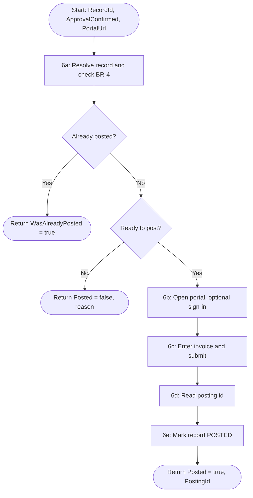

# Solution Design Document — PostToERP_Sagar

> **Template:** RPA Process / Library / Test Automation.
> **Phase 2 sections:** §5, §9, §10, §11, §12, §13, §14. **Phase 3 sections:** all others.
> **Data:** synthetic, USD only. Field names and format descriptions only — no sample amounts, tax IDs or credentials.

---

## Document History

| Date | Version | Author | Role | Comments |
|---|---|---|---|---|
| 2026-10-08 | 1.0 | uipath-planner | Generated by AI Agent | Initial SDD generated from `invoice-approval-pdd.md` and its gap analysis |

---

<!-- DO NOT RENAME: uipath-planner detects SDDs via this exact heading or the marker below. -->
<!-- planner-handoff:v1 -->
## Planner Handoff

| Field | Value |
|---|---|
| **Status** | ready |
| **Execution autonomy** | autonomous |
| **Delivery model** | cloud |
| **SDD scope** | solution |
| **Solution root SDD** | invoice-approval-solution-sdd.md |
| **Solution ID** | invoice-approval |
| **Project SDD role** | child |
| **Independently executable** | no — Lane A derives tasks only via the Solution root |
| **Project list section** | §11 |
| **Tasks file** | `implementation-tasks.md` |
| **Generated by** | uipath-planner |
| **Generation date** | 2026-10-08 |
| **Template validation** | passed |

---

## Decisions Made

> Autonomous mode picked the five architectural decisions below without a user checkpoint. Override by rerunning in Interactive mode or by editing the relevant SDD section.

| # | Decision | Picked | One-sentence reason |
|---|---|---|---|
| 1 | **Platform constraints** (Constraint Gate) | cloud; no products blocked | Session host is Automation Cloud (staging); serverless robot available. |
| 2 | **Scope** (Level 1) | Solution child — RPA Process | The AP portal has no API: posting is UI-only, so RPA is required (PDD step 6). |
| 3 | **RPA sub-type** (Level 1.5) | Process | One posting per job, started by BPMN. |
| 4 | **Authoring mode** (Level 2) | XAML | Over 70% browser UI automation with minimal data shaping. |
| 5 | **Framework** | Sequence | Single record per job; retry owned by the BPMN boundary. |

---

## Recommended Scope

**Recommendation:** SOLUTION(Maestro BPMN, RPA Process ×2, Agents ×2, Coded App; components: IXP model, Coded Functions, Data Fabric)
**Delivery model:** cloud
**Blocked by platform:** none
**Need profile:** Post each ready invoice in the AP portal exactly once and close it (PDD step 6, BR-4, E9).

---

## Action Required — SME Review Items

| # | Section | Item | Question | Default applied | Blocking |
|---|---|---|---|---|---|
| 1 | §15 | Portal credential | Should the portal sign-in come from an Orchestrator credential asset? | Yes — `AP_Portal_Credential`; sign-in stays optional (Try/Catch, short timeout). | no |
| 2 | §4 BR-04 | Payment submission | Is portal posting the same as "submitted for payment"? | Yes — the portal posting id is the payment submission evidence. | no |
| 3 | §16 | UAT / PROD | Target tenants, folders and portal URLs? | *Training* tenant and the hosted mock portal only. | no |

> These items are marked `[SME REVIEW]` in the document. Default-carried items (Blocking = no) do not block task derivation — the automation is built on the recorded defaults, which must be verified before production sign-off. Any Blocking = yes item keeps the handoff at `Status: draft`.

---

## Table of Contents

1. Process Overview
2. Process Map
3. Detailed Process Steps
4. Business Rules
5. Data Definitions
6. Value Mappings
7. Exception Handling
8. Error Handling
9. Application Inventory
10. Master Project Architecture
11. Project Structure
12. Queue Architecture
13. Implementation Mode
14. Packages
15. Credentials & Assets
16. Deployment Environment
17. Testing Strategy
18. Next Steps

---

## 1. Process Overview

| Field | Value |
|---|---|
| **Process name** | PostToERP_Sagar |
| **Objective** | For one invoice record, confirm it is ready to post (BR-4), post it in the hosted AP portal, and mark the record `PostedToERP = true`, `InvoiceLifecycleState = POSTED` — never twice. |
| **Department / Function** | Finance — Accounts Payable posting |
| **Schedule** | On demand: one job per ready invoice, started by `InvoiceApprovalProcess_Sagar` |
| **Volume** | [SME REVIEW] not stated in the PDD (peak: unknown) |
| **Avg. handling time (manual)** | [SME REVIEW] not stated in the PDD |
| **Avg. handling time (automated target)** | [DEFAULT] under 3 minutes (first request may wait 30–60 s for a portal cold start) |
| **Exception rate** | [SME REVIEW] not stated in the PDD |
| **Source PDD** | `invoice-approval-pdd.md` (step 6, BR-4, E9, E11, AC-9, AC-10) |

### Delivery Team

| Role | Name | Contact |
|---|---|---|
| SME / Process Owner | Accounts Payable (PDD) | — |

### In Scope

- Read the record and evaluate BR-4 (PO matched, not posted, no approval needed or approved).
- Open the AP portal at `PortalUrl`, sign in when the form is shown, enter the invoice, submit, read the posting id.
- Mark the record posted and close it.

### Out of Scope

- Payment runs inside the ERP (PDD §13).
- Deciding approval (the review app and BPMN do that).
- Any localhost portal: only the hosted portal URL is valid.

### Assumptions

- The portal exposes stable element ids for the sign-in and posting form (`mock-erp/README.md`).
- `ApprovalConfirmed` is true only when BPMN observed `APPROVED`; auto-approved invoices pass false with `ApprovalNeeded = false`.
- The robot runs on serverless (Chrome, Simulate input).

---

## 2. Process Map



| Step | Description | Application |
|---|---|---|
| 6a | Resolve record, BR-4 check | Data Fabric |
| 6b | Open portal, optional sign-in | AP portal (Chrome) |
| 6c | Fill and submit the posting form | AP portal |
| 6d | Read confirmation | AP portal |
| 6e | Mark posted | Data Fabric |

---

## 3. Detailed Process Steps

### Step Summary

| # | Action | Application | Input | Output | Rules | Errors |
|---|---|---|---|---|---|---|
| 6a | Query by sort, filter by Id in VB LINQ (`Guid.Parse`), evaluate BR-4 | Data Fabric | `RecordId`, `ApprovalConfirmed` | ready flag, posted flag, invoice fields | BR-01–BR-03 | B1, B2, E1 |
| 6b | Use Browser on `PortalUrl` (Simulate); sign in inside Try/Catch | AP portal | `PortalUrl`, credential | signed-in session | BR-05 | E2, E3 |
| 6c | Type VendorName, InvoiceNumber, PONumber, total text; submit | AP portal | invoice fields | — | BR-06 | E2 |
| 6d | Read posting id and status | AP portal | — | `PostingId` | BR-04 | B3 |
| 6e | Update entity record (`.Id` set) | Data Fabric | `RecordId`, `PostingId` | record POSTED | BR-04 | E1 |

### Step Details

#### Step 6a — Ready-to-post check

`ReadyToPost = POMatched AND NOT PostedToERP AND (NOT ApprovalNeeded OR (ApprovalConfirmed AND InvoiceLifecycleState = APPROVED))`.
A missing `PostedToERP` is read as false. When already posted, the job returns `WasAlreadyPosted = true` and
`Posted = true` without touching the portal.

---

## 4. Business Rules

| ID | Rule Name | Description | Trigger Condition | Validation (regex / range / type / allowed values) | Affected Steps |
|---|---|---|---|---|---|
| BR-01 | Ready to post (PDD BR-4) | Post only when PO matched, not already posted, and approval not needed or given | Every run | boolean expression in Step 6a | 6a |
| BR-02 | Never post twice (PDD E9) | An already-posted record is returned unchanged | `PostedToERP = true` | boolean | 6a |
| BR-03 | Rejected never posted (PDD AC-9) | `REJECTED` records are not ready | lifecycle = REJECTED | `InvoiceLifecycleState ∉ {REJECTED}` | 6a |
| BR-04 | Close on confirmation | After a confirmed posting set `PostedToERP = True` and `InvoiceLifecycleState = POSTED` | posting id returned | `PostingId` non-empty; state ∈ {POSTED} | 6d, 6e |
| BR-05 | Portable selectors | Element selectors use stable `id` (+ tag) only; window `<html app='chrome.exe' title='Globex AP Portal*' />` | Every UI step | no idx / text / css / AX selectors; no localhost in `.objects/` | 6b–6d |
| BR-06 | Amount as text | Total is typed as formatted text from the record; never logged | 6c | decimal formatted with 2 dp | 6c |
| BR-07 | Confidential logging | Logs show record Id, invoice number and posting id only | All steps | n/a (behavioural) | all |

---

## 5. Data Definitions

### Option B — XAML Mode

#### Transaction Data (Dictionary)

| Key | Type | Source | Description |
|---|---|---|---|
| `RecordId` | String (InOut) | Job input | Data Fabric record Id |
| `ApprovalConfirmed` | Boolean | Job input | True when the reviewer approved |
| `PortalUrl` | String | Job input | Hosted AP portal URL |
| `VendorName` / `InvoiceNumber` / `PONumber` | String | Record | Posting form fields |
| `TotalAmountText` | String | Record | Confidential; typed, never logged |

#### Output Data (Dictionary)

| Key | Type | Description |
|---|---|---|
| `Posted` | Boolean | True when the invoice is posted (now or before) |
| `WasAlreadyPosted` | Boolean | True when no portal action was needed |
| `PostingId` | String | Portal posting reference |
| `ErrorMessage` | String | Non-confidential reason when not posted |

#### Status/Category Values

| Variable | Allowed Values |
|---|---|
| `InvoiceLifecycleState` (written) | POSTED |
| `InvoiceLifecycleState` (accepted for posting) | AUTO_APPROVED, APPROVED (or ApprovalNeeded = false) |

---

## 6. Value Mappings

### Record to portal form — `AP_Invoice_Sagar` to AP portal

| Source Value | Target Value |
|---|---|
| `VendorName` | vendor field (element id per `mock-erp/README.md`) |
| `InvoiceNumber` | invoice number field |
| `PONumber` | PO number field |
| `TotalAmount` (decimal) | amount field (text, 2 dp) |

---

## 7. Exception Handling

| ID | Exception Name | Trigger Step | Trigger Condition | Action |
|---|---|---|---|---|
| B1 | Already posted (PDD E9) | 6a | `PostedToERP = true` | Return `WasAlreadyPosted = true`, `Posted = true`; no portal action |
| B2 | Not ready to post | 6a | BR-01 false (unmatched, rejected, not approved) | Return `Posted = false` with reason; record unchanged |
| B3 | Portal rejects the posting | 6d | No posting id / error status shown | Return `Posted = false`; record unchanged |

**Default handler:** For any unanticipated business exception, return `Posted = false` with a non-confidential reason and leave the record unchanged.

---

## 8. Error Handling

| ID | Error Name | Trigger Step | Trigger Condition | Retry Policy | Action |
|---|---|---|---|---|---|
| E1 | Data Fabric error | 6a, 6e | HTTP error | none in workflow (BPMN boundary retries) | Fault the job |
| E2 | Element not found | 6b–6d | Selector timeout | Retry Scope ×2 on the submit block [DEFAULT] | Fault; "nothing found, not even BODY" means the wrong page opened (check `.objects/` URLs) |
| E3 | Portal cold start / unreachable | 6b | Page load timeout | wait up to 60 s, then fail | Fault the job (PDD E11) |
| E4 | Mark-posted failed after a successful posting | 6e | update error | none | Fault with `PostingId` in the message so AP can reconcile; next run detects via portal [SME REVIEW] |

**Default handler:** For any unanticipated system error, close the browser, log the record Id and error type, and fault the job.

---

## 9. Application Inventory

| # | Application | Interface | Access Method | Role | Interaction Pattern | Session Management |
|---|---|---|---|---|---|---|
| 1 | Data Fabric `AP_Invoice_Sagar` | API | Data Service activities | SOURCE / TARGET | READ-WRITE | PER_RUN |
| 2 | Globex AP portal (hosted mock ERP) | WEB | Chrome via Use Browser, `PortalUrl` | TARGET | WRITE | PER_RUN |

### Interactive Authentication / Re-auth Handoff

Not applicable — the portal sign-in is a scriptable username/password form; no human-only factor.

### Integration Service Connections

| Connector | System | Access Method | Used By |
|---|---|---|---|
| — | AP portal | UI automation (no API, no connector) | Steps 6b–6d |

---

## 10. Master Project Architecture

### Option B — Single Project

**Decomposition signals matched:** 0-1 (threshold not met)

> Single project; no queue is defined or consumed, so §12 states that explicitly.

---

## 11. Project Structure

### Solution / Project Breakdown

| Project | Product (RPA / API / Agent / …) | GitHub Repository | Folder | Attended / Unattended |
|---|---|---|---|---|
| PostToERP_Sagar | RPA | `UiPath-Coders/commercial_bootcamp_Sagar` (`lab4-rpa/PostToERP_Sagar`) | `Agentic Bootcamp/APAutomation_Sagar` | Unattended (serverless) |

### Reusable Components

| Type (reused / new-reusable) | Name | Details |
|---|---|---|
| reused | Object Repository for the Globex AP portal | Captured on the **hosted** portal; id-based selectors |
| reused | `AP_Invoice_Sagar` entity store | Copied from the Lab 2 store, namespace = project name |

### Project Type

| # | Project Name | Sub-type |
|---|---|---|
| 1 | `PostToERP_Sagar` | Process |

### Project Mode Decision

| # | Project | Type | Compatibility | Authoring | Attendance | Initiation | Framework | Persistence (long-running) | Packaging |
|---|---|---|---|---|---|---|---|---|---|
| 1 | `PostToERP_Sagar` | Process | Cross-platform (Portable, VB) | XAML | Unattended | API (BPMN serviceTask) | Sequence | NO | Solution (.uipx) — linked by `InvoiceApprovalSolution_Sagar` |

### Recommended Structure

```text
PostToERP_Sagar/
├── project.json
├── project.uiproj
├── Main.xaml
├── ResolveInvoice.xaml
├── PostInvoiceInPortal.xaml
├── MarkInvoicePosted.xaml
├── .objects/
└── .entities/EntitiesStore.json
```

### Workflow Inventory

| # | Workflow File | Responsibility | PDD Steps | Inputs | Outputs |
|---|---|---|---|---|---|
| 1 | `Main.xaml` | Entry point; sequence 6a → 6e | 6 | `RecordId: String (InOut)`, `ApprovalConfirmed: Boolean`, `PortalUrl: String` | `Posted: Boolean`, `WasAlreadyPosted: Boolean`, `PostingId: String`, `ErrorMessage: String` |
| 2 | `ResolveInvoice.xaml` | Read record, evaluate BR-01/02/03 | 6a | `in_RecordId: String`, `in_ApprovalConfirmed: Boolean` | `out_IsReadyToPost`, `out_WasAlreadyPosted: Boolean`; `out_ErrorMessage`, `out_RecordId`, `out_InvoiceNumber`, `out_VendorName`, `out_PONumber`, `out_TotalAmountText: String` |
| 3 | `PostInvoiceInPortal.xaml` | Optional sign-in, fill, submit, read posting id | 6b–6d | `in_PortalUrl`, `in_VendorName`, `in_InvoiceNumber`, `in_PONumber`, `in_TotalAmountText: String` | `out_PostingId`, `out_PostingStatus: String`; `out_Success: Boolean` |
| 4 | `MarkInvoicePosted.xaml` | Set PostedToERP and POSTED | 6e | `in_RecordId`, `in_PostingId: String` | — |

Main declares no locals named like its outputs (`posted`, `postingId`, `recordId`, `errorMessage`); locals are prefixed (e.g. `portalPostingId`).

### UI Element Groups (selector inventory)

| # | Application | Screen | Elements (names) | Capture method |
|---|---|---|---|---|
| 1 | Globex AP portal | Sign-in | `#input-portal-username`, `#input-portal-password`, `#btn-sign-in` | `uia-configure-target` on the hosted portal (fallback: element ids from `mock-erp/README.md`) |
| 2 | Globex AP portal | Post invoice | vendor, invoice number, PO number, amount, submit (ids per `mock-erp/README.md`) | `uia-configure-target` on the hosted portal |
| 3 | Globex AP portal | Confirmation | posting id, posting status | `uia-configure-target` on the hosted portal |

### Workflow Dependencies

```text
Main.xaml
├── calls ResolveInvoice.xaml
├── calls PostInvoiceInPortal.xaml
└── calls MarkInvoicePosted.xaml
```

---

## 12. Queue Architecture

Not applicable: this project neither defines nor consumes an Orchestrator queue (it is started per record by BPMN).

### Queue Definitions

| Queue Name | Producer Project | Consumer Project | Trigger Type | Max Retries |
|---|---|---|---|---|
| — | — | — | — | — |

### Queue Configuration

No queue to configure.

### Queue Item Schema

No queue items.

### Queue Processing Rules

- Not applicable; idempotency is owned by BR-02 (record check before posting).

---

## 13. Implementation Mode

**Recommendation:** XAML

**Justification (2-3 sentences):** §3 shows steps 6b–6d are browser UI driving and 6a/6e are single Data Fabric calls; the only data shaping is one LINQ filter and one amount format. Coded C# checklist items are not met; XAML with Try/Catch and Retry Scope covers the error handling.

> **Note:** This is a preliminary recommendation. Detailed decision criteria will be applied during implementation and may adjust this choice — but the architectural recommendation must already pass the checklist.

---

## 14. Packages

| Package | Version | Purpose |
|---|---|---|
| `UiPath.System.Activities` | 26.8.2 | Core activities, Try/Catch, Retry Scope |
| `UiPath.DataService.Activities` | 25.9.10 | Query / Update Entity Record |
| `UiPath.UIAutomation.Activities` | 26.10.3 | Use Browser, Type Into, Click, Get Text (Simulate) |

---

## 15. Credentials & Assets

| Asset Name | Type | Description | Notes |
|---|---|---|---|
| `AP_Portal_Credential` | CREDENTIAL | AP portal sign-in | [SME REVIEW] create in `Agentic Bootcamp/APAutomation_Sagar`; never in source or logs |
| `PortalUrl` (argument) | TEXT | Hosted portal URL | Passed per job by BPMN; never a localhost URL |

---

## 16. Deployment Environment

### Robot & Runtime

| Field | Value |
|---|---|
| **Robot type** | UNATTENDED (serverless) |
| **Trigger** | EVENT (BPMN serviceTask) |
| **Orchestrator tenant / folder** | Training / `Agentic Bootcamp/APAutomation_Sagar` |
| **UiPath Studio version** | [SME REVIEW] not recorded |
| **UiPath Robot version** | Serverless (cloud-managed) |
| **Orchestrator** | Cloud |
| **Cross-platform / Windows-only** | Cross-platform |
| **Recommended screen resolution** | Serverless default; Simulate input avoids resolution dependence |
| **Source repository** | `UiPath-Coders/commercial_bootcamp_Sagar` |
| **Shared libraries referenced** | none |

### Environments (DEV / UAT / PROD)

| Item | DEV | UAT | PROD | Used By |
|---|---|---|---|---|
| Orchestrator + Tenant/Service | staging / customersuccessamer / Training | [SME REVIEW] | [SME REVIEW] | This project |
| Folder | `Agentic Bootcamp/APAutomation_Sagar` | [SME REVIEW] | [SME REVIEW] | This project |
| Portal URL | hosted mock portal | [SME REVIEW] | [SME REVIEW] | This project |

### Development & Production Hosts

| Environment | Machine Name(s) / VM Pool | Notes |
|---|---|---|
| Development | Default Serverless (inherited) | Runtime type Serverless; never force Unattended |
| UAT | [SME REVIEW] | — |
| Production | [SME REVIEW] | — |

### Runtime Prerequisites

- Chrome with the UiPath extension on the serverless image (cloud-managed).
- Network access to the hosted portal (first request may take 30–60 s).
- `grep -rl localhost` on the project (excluding `.local`) returns nothing; no `role='AX` selectors.

### Scalability & Concurrency

| Field | Value |
|---|---|
| **Volume** | [SME REVIEW] |
| **Avg handling time (automated)** | [DEFAULT] 3 minutes |
| **Peak window** | [SME REVIEW] |
| **Completion SLA** | [SME REVIEW] |
| **Exception + retry factor** | [DEFAULT] 1.2 |
| **Utilization target** | [DEFAULT] 0.8 |
| **Required runtimes** | serverless — per job; [SME REVIEW] quota |
| **Concurrent job limit** | [DEFAULT] one job per record |
| **Machine template / VM pool** | Default Serverless |
| **Robot accounts** | Inherited "Agentic Labs Robot" |
| **Session requirements** | Serverless browser session |
| **Calendars / time zone** | UTC |
| **Overlapping-job policy** | Two jobs for the same record must not run together — BPMN starts one per instance |
| **License assumption** | [SME REVIEW] serverless units |

### Operational Support

| Concern | Design decision |
|---|---|
| **Idempotency** | Pre-write check `PostedToERP` (BR-02) |
| **Checkpoint & restart** | Re-run is safe until 6d; after 6d see E4 |
| **Session recovery** | Browser closed on any fault; next run starts fresh |
| **Correlation & logging** | Record Id, invoice number, posting id |
| **Alerting** | BPMN *Operational Failure* end; job failure alerts |
| **Dashboards** | Orchestrator jobs for the folder |
| **Reprocessing** | Restart the BPMN instance or start the job with the record Id |
| **Support ownership** | [SME REVIEW] |
| **Business continuity** | Manual posting in the portal, then set the record POSTED [SME REVIEW] |

### Security & Data Handling

| Concern | Design decision |
|---|---|
| **Data classification & PII** | TotalAmount and VendorTaxId never logged; tax ID not read at all |
| **Credentials** | Portal credential in an Orchestrator credential asset (§15) |
| **Service accounts & privilege** | Entity read/update; credential read in the folder |
| **Encryption** | TLS to portal and Data Service |
| **Retention & audit** | Posting id recorded in logs and the record |
| **Network** | Hosted portal only |

### Delivery Quality Gates

| Gate | Decision |
|---|---|
| **Package versioning** | Semver; bump on every change (current 1.0.0) |
| **Workflow Analyzer** | [DEFAULT: yes] |
| **Source control** | Lab folder only, branch `main` |
| **CI validation** | `uip rpa build` + localhost / AX grep checks |
| **Promotion path** | DEV only in this lab |
| **Rollback** | Previous package version retained |
| **Production smoke test** | Serverless job on an auto-approved record against the hosted portal |

### Non-Functional Requirements

| Dimension | Requirement / Design decision |
|---|---|
| **Security** | See Security & Data Handling above |
| **Performance** | Simulate input; one browser session per job |
| **Scalability** | See Scalability & Concurrency above |
| **Availability / Resilience** | Idempotent posting check; cold-start tolerance |
| **Logging & Monitoring** | No confidential values; posting id logged |
| **Compliance** | PDD §11 |

---

## 17. Testing Strategy

### Requirements Traceability

| PDD Step / Rule | Covered By (test IDs) |
|---|---|
| Step 6 / BR-01 (PDD BR-4) | HP-1, HP-2, EX-B2 |
| BR-02 (PDD E9, AC-10) | EX-B1 |
| BR-03 (PDD AC-9) | EX-B2b |
| BR-04 | HP-1 |
| BR-05 | NF-5 |
| BR-07 | NF-6 |

### Canonical Test Case

| Field | Value |
|---|---|
| `RecordId` | Id of an AUTO_APPROVED record (PO matched, approval not needed, not posted) |
| `ApprovalConfirmed` | `false` |
| `PortalUrl` | hosted mock portal URL |

### Happy Path Assertions

1. HP-1 (auto-approved route): `Posted = true`, `PostingId` non-empty; record `PostedToERP = true`, `InvoiceLifecycleState = POSTED`.
2. HP-2 (approved route): record APPROVED with `ApprovalConfirmed = true` → same assertions (closes PDD §16 gap 5).

### Exception Test Cases

| Exception ID | Test Setup | Trigger | Expected Outcome |
|---|---|---|---|
| B1 | record already POSTED | run | `WasAlreadyPosted = true`; no portal post |
| B2 | record HOLD_PO_MISMATCH | run | `Posted = false`; record unchanged |
| B2b | record REJECTED | run | `Posted = false`; record unchanged |
| B3 | portal returns an error status | run | `Posted = false`; record unchanged |

### System Error Scenarios

| Error ID | Testable in Dev? | How to Simulate | Expected Outcome |
|---|---|---|---|
| E1 | NO | Data Service outage | job faults |
| E2 | YES | wrong element id in a test copy | job faults after retries |
| E3 | YES | first call after portal idle | succeeds within the 60 s wait |
| E4 | NO | update failure after posting | fault message carries the posting id |

### Non-Functional Tests

| Test | Scenario | Expected |
|---|---|---|
| Performance / load | 5 sequential postings | each under the [DEFAULT] target |
| Concurrent robots | same record started twice | second run returns `WasAlreadyPosted` or not ready; one posting only |
| Recovery / restart | kill the job during 6c | re-run posts once |
| Credential expiration | wrong portal credential | clean failure; password never logged |
| UI compatibility | serverless Chrome | NF-5: id selectors hold; no AX selectors |
| Security | inspect logs | NF-6: no amounts or tax IDs |

### UAT Acceptance Criteria

1. PDD AC-6 and AC-10: auto-approved and approved invoices posted once each; zero duplicate postings.
2. PDD AC-9: zero rejected invoices posted.

### Test Data & Cleanup

| Item | Decision |
|---|---|
| **Test data source** | Synthetic records created by intake |
| **Cleanup** | Posted test records are kept as evidence; no deletion without confirmation |

### Production Verification

1. First postings reconciled one by one between the portal list and the records before unattended ramp-up.

---

## 18. Next Steps

This SDD captures architecture and decisions. To generate the implementation task list and execute the build, load `uipath-planner` with the Solution root SDD path (this child is not independently executable):

> Load `uipath-planner`. SDD path: `invoice-approval-solution-sdd.md`.

The planner will:

1. Detect the `## Planner Handoff` header and read the fields above.
2. Parse the root Project Inventory and this file's §11, and derive a per-skill task list.
3. Write `implementation-tasks.md` alongside this SDD with the task list and dependencies.
4. Emit live `TaskCreate` calls that route each task to the correct specialist (`uipath-rpa`, `uipath-platform`, `uipath-solution`, etc.).
5. If `Execution autonomy: interactive`, enter plan mode for task review before execution.

Implementation tasks **do not live in this SDD** — they live in the planner's output. The planner is the single source of truth for skill routing and task ordering.

### Terminal artefact — packaging per the §11 Project Mode Decision

**Packaging = Solution (`.uipx`)** — this project is linked into `InvoiceApprovalSolution_Sagar`. Load the **`uipath-solution`** skill and run:

```bash
uip solution init <SOLUTION_NAME>
uip solution projects add <PROJECT_PATH> [--solution-file <SOLUTION_FILE>]    # repeat per project in the unified list
uip solution resources refresh
uip solution pack <SOLUTION_DIR> <OUTPUT_DIR>
```

The `.uipx` promotes via `uip solution publish` / `uip solution deploy run`. Full lifecycle: `uipath-solution` skill.

---

**End of Solution Design Document.**
